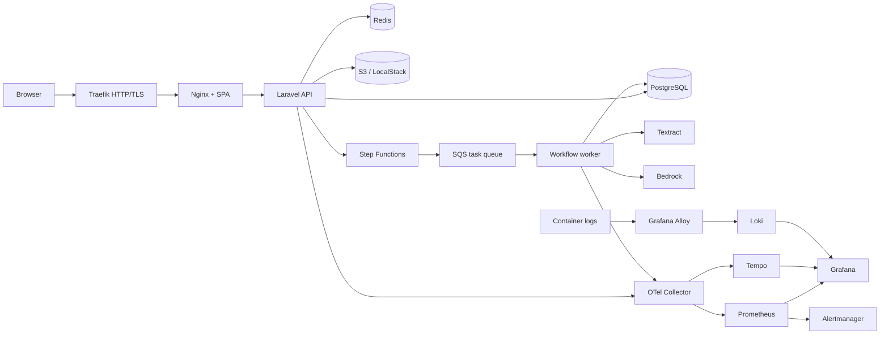

# Alittlebyte Document Pipeline

<p align="center">
  
  
  
  
  
  
  
  
  
  
  
  
  
</p>

<p align="center">
  <a href="https://github.com/aLittleByte-19/PoC/actions/workflows/pint.yml"></a>
  <a href="https://github.com/aLittleByte-19/PoC/actions/workflows/pest.yml"></a>
  <a href="https://github.com/aLittleByte-19/PoC/actions/workflows/quality.yml"></a>
  <a href="https://github.com/aLittleByte-19/PoC/actions/workflows/containers.yml"></a>
  <a href="https://github.com/aLittleByte-19/PoC/actions/workflows/accessibility.yml"></a>
  <a href="https://github.com/aLittleByte-19/PoC/actions/workflows/accessibility.yml"></a>
</p>

Applicazione per generazione assistita di comunicazioni interne e analisi documentale PDF. Lo stack locale e completamente orchestrato con Docker Compose: non richiede PHP, Composer, Node.js, npm, Terraform o tool AWS installati sull'host.

## Funzionalita

- SPA React/Vite/TypeScript servita da Nginx.
- API JSON Laravel versionata sotto `/api/v1`.
- Generazione di comunicazioni tramite Bedrock.
- Upload PDF, archiviazione S3, OCR Textract opzionale, split documentale e persistenza dei risultati.
- Workflow asincrono Step Functions + SQS task token, con DLQ e worker dedicato.
- Configurazione runtime da SSM Parameter Store e Secrets Manager.
- Observability con OpenTelemetry Collector, Prometheus, Tempo e Grafana; alerting con Alertmanager.
- Aggregazione log di tutti i container con Grafana Alloy e Loki, consultabile in Grafana.
- Superficie runtime ridotta: `/admin` e vecchi endpoint legacy rispondono 404.

## Architettura



La pipeline documentale usa LocalStack per S3, SQS, Step Functions, SSM, Secrets Manager, EventBridge e SES locale. S3, Textract e Bedrock possono essere instradati verso AWS reale tramite parametri runtime, lasciando il resto dello stack in locale.

## Struttura Repository

- `app/Copilot`: dominio applicativo, servizi AI/OCR/workflow, audit e supporto runtime.
- `app/Http`: controller API, middleware, request validation e risposte HTTP.
- `app/Models/Copilot`: model Eloquent.
- `apps/frontend`: SPA React organizzata per `app`, `components`, `features`, `hooks`, `lib`, `styles`.
- `openapi/v1/alittlebyte-poc-api.yaml`: contratto API versionato, sorgente del client TypeScript generato.
- `infra/localstack`: Terraform per dipendenze AWS-like locali.
- `infra/aws`: area riservata alla baseline AWS reale quando IAM, remote state e ownership saranno definiti.
- `docker`: immagini runtime, Traefik, Nginx, observability e certificati locali.
- `docs`: architettura, runbook, sicurezza, operation guide e diagrammi.

## Avvio Locale

```bash
cp .env.example .env
make setup
```

`make setup` esegue:

- generazione certificato TLS locale;
- build immagini Docker;
- avvio PostgreSQL, Redis e LocalStack;
- `terraform init/apply` su `infra/localstack`;
- migrazioni Laravel;
- avvio app, worker, Nginx, Traefik e servizi di osservabilita.

Endpoint:

- Applicazione HTTP: `http://localhost:8080`
- Applicazione HTTPS locale: `https://localhost:8443`
- Health: `https://localhost:8443/health`
- Readiness: `https://localhost:8443/ready`
- Prometheus: `http://localhost:9090`
- Alertmanager: `http://localhost:9093`
- Grafana: `http://localhost:3000`
- Tempo: `http://localhost:3200`
- LocalStack edge: `http://localhost:4566`

Il certificato TLS locale e self-signed. Firefox o altri browser possono mostrare un warning finche il certificato in `docker/traefik/certs` non viene considerato attendibile dal trust store locale.

## Configurazione

I container ricevono solo il bootstrap necessario a leggere la configurazione runtime:

```env
CONFIG_SOURCE=aws
CONFIG_SSM_PATH=/poc/app
CONFIG_SECRET_IDS=/poc/app/runtime
CONFIG_AWS_ENDPOINT=http://localstack:4566
CONFIG_AWS_REGION=eu-north-1
```

Terraform scrive i parametri applicativi in SSM e i segreti in Secrets Manager. I valori principali si impostano in `.env` prima di `make infra-apply`.

Parametri applicativi:

| Variabile | Uso |
| --- | --- |
| `POC_APP_URL` | URL pubblico usato da Laravel. |
| `POC_DOCUMENT_DISK` | `s3` per LocalStack, `real_s3` per S3 reale. |
| `POC_MAX_UPLOAD_MB` | Limite upload PDF. |
| `POC_MAX_PDF_PAGES` | Limite pagine PDF. |
| `POC_PROCESSING_TIMEOUT_SECONDS` | Timeout massimo pipeline documentale. |
| `POC_CONFIDENCE_THRESHOLD` | Soglia di confidenza per revisione. |
| `POC_IDENTITY_MODE` | Modalita identita locale o header trusted. |

## AWS Reale per S3, Textract e Bedrock

Questa modalita usa un runtime ibrido controllato: LocalStack resta responsabile di SSM, Secrets, SQS e Step Functions; S3, Textract e Bedrock puntano ad AWS reale. Impostare in `.env`:

```env
POC_DOCUMENT_DISK=real_s3

# Regione e bucket usati per gli oggetti sorgente S3.
AWS_REAL_REGION=eu-central-1
AWS_REAL_S3_BUCKET=nome-bucket-documenti
AWS_REAL_S3_PREFIX=documents/

# Credenziali temporanee o access key dedicate allo smoke locale.
AWS_REAL_ACCESS_KEY_ID=
AWS_REAL_SECRET_ACCESS_KEY=
AWS_REAL_SESSION_TOKEN=

# Textract usa la regione OCR/S3.
TEXTRACT_ENABLED=true
TEXTRACT_REGION=eu-central-1
TEXTRACT_MAX_PAGES=50
TEXTRACT_MAX_BYTES=20971520

# Bedrock puo usare una regione diversa.
BEDROCK_REGION=eu-north-1
POC_BEDROCK_MODEL_ID=amazon.nova-lite-v1:0
BEDROCK_ENDPOINT=
```

Dopo ogni modifica a questi valori, riscrivere SSM/Secrets e ricaricare i processi applicativi:

```bash
make refresh-runtime
```

`make refresh-runtime` esegue `make infra-apply` e ricrea i container `app` e `queue`, che ricaricano la configurazione runtime.

Note operative:

- Le credenziali `AWS_REAL_ACCESS_KEY_ID` / `AWS_REAL_SECRET_ACCESS_KEY` / `AWS_REAL_SESSION_TOKEN` sono condivise da S3, Textract e Bedrock: lo stesso principal IAM deve avere accesso ai tre servizi (un ruolo limitato al solo Bedrock non basta per S3/Textract).
- `AWS_REAL_REGION` e `TEXTRACT_REGION` devono rappresentare la stessa regione: Textract legge l'oggetto dal bucket S3 e richiede che si trovino nella medesima regione.
- `BEDROCK_REGION` e indipendente e deve essere una regione dove il modello scelto e abilitato per l'account.
- Con `TEXTRACT_ENABLED=true`, `POC_DOCUMENT_DISK` deve essere `real_s3`: i documenti devono risiedere su S3 reale, altrimenti l'avvio del workflow viene rifiutato con un errore esplicito.
- Le credenziali reali non vanno committate. Con IAM aziendale, preferire credenziali temporanee/OIDC/role assumption e secret injection gestita.
- La workflow orchestration resta locale finche non viene aggiunto Terraform AWS reale per Step Functions, SQS, SSM e Secrets Manager.

## Observability

Servizi locali:

| Servizio | URL | Uso |
| --- | --- | --- |
| Grafana | `http://localhost:3000` | Dashboard applicative, log e trace drill-down. |
| Prometheus | `http://localhost:9090` | Metriche e regole di alerting. |
| Alertmanager | `http://localhost:9093` | Routing alert. |
| Tempo | `http://localhost:3200` | Storage trace OTLP. |
| Loki | interno `loki:3100` | Storage log dei container. |
| Grafana Alloy | interno `alloy:12345` | Raccolta log dei container e invio a Loki. |

Metriche, trace e log convergono in Grafana, che carica da file i datasource Prometheus, Tempo e Loki. Grafana Alloy raccoglie i log di tutti i container del progetto e li invia a Loki; nella dashboard `Logs and Errors` e nei pannelli log delle altre dashboard si filtrano per servizio (es. `{project="poc", service="queue"}`) e per livello di errore. Le metriche di dominio del worker (Textract, SQS, completamenti) sono esposte tramite un volume condiviso tra `app` e `queue`, così da raggiungere l'endpoint `/internal/metrics` scrappato da Prometheus.

Credenziali Grafana di default (da cambiare se Grafana viene esposto oltre `localhost`):

```env
GRAFANA_ADMIN_USER=admin
GRAFANA_ADMIN_PASSWORD=admin
```

Le dashboard sono provisioning-as-code in `docker/grafana/dashboards` (`api-golden-signals`, `document-pipeline`, `ai-ocr-quality`, `queues-and-dlq`, `logs-and-errors`). Per modificarle:

1. Aprire Grafana e modificare una dashboard.
2. Esportare il JSON aggiornato.
3. Sostituire il file corrispondente in `docker/grafana/dashboards`.
4. Riavviare Grafana con `docker compose restart grafana`.
5. Validare la configurazione con `make observability-config`.

Prometheus carica regole da `docker/prometheus/rules`; Alertmanager da `docker/alertmanager/alertmanager.yml`; OTel Collector da `docker/otel-collector/config.yml`.

## Comandi Principali

| Comando | Descrizione |
| --- | --- |
| `make setup` | Setup completo locale. |
| `make release` | Esegue le migrazioni applicative. |
| `make refresh-runtime` | Riapplica SSM/Secrets e ricrea app e worker dopo modifiche al `.env`. |
| `make logs` | Segue log app, worker, Nginx e LocalStack. |
| `make fresh` | Resetta database e dati generati. |
| `make verify-fast` | Backend, frontend, infra e observability senza audit estesi. |
| `make verify` | Quality gate completo locale. |
| `make frontend-a11y` | Axe e Pa11y sullo stack HTTPS locale. |
| `make aws-smoke` | Smoke opzionale, richiede parametri AWS reali. |

## Test e Quality Gate

Tutti i controlli sono containerizzati.

```bash
make test
make pint
make frontend-typecheck
make frontend-test
make frontend-build
make frontend-audit
make openapi-validate
make observability-config
make verify-fast
make verify
```

CI/CD GitHub Actions:

- `Pest`: test Laravel.
- `Pint`: code style PHP.
- `Frontend`: OpenAPI client generation, TypeScript, Vitest, build e npm audit production.
- `Quality Gates`: Composer validate, Larastan/PHPStan, OpenAPI lint, Terraform validate, observability config.
- `Accessibility`: Axe e Pa11y sullo stack locale.
- `LocalStack Smoke`: Compose, Terraform, migrazioni, health/readiness/API e dashboard locali.
- `Containers`: build immagini runtime, Trivy scan, publish GHCR su branch/tag abilitati.
- `AWS Smoke`: workflow manuale per role OIDC aziendale quando disponibile.

## Sicurezza

- Nessuna interfaccia `/admin` a runtime.
- API JSON versionata e documentata da OpenAPI.
- Configurazione separata tra parametri non sensibili e segreti.
- Upload PDF limitati per dimensione e pagine.
- Worker asincrono con DLQ e idempotenza task-token.
- Metriche interne non esposte attraverso Traefik pubblico.
- Container runtime separati per app, worker, Nginx e tool.
- Hardening runtime PHP (`docker/php/security.ini`): `expose_php` off, errori non in output, `allow_url_fopen`/`allow_url_include` off, cookie di sessione `HttpOnly`/`Secure`/`SameSite=Strict`, `disable_functions` sulle funzioni di esecuzione shell.
- Header di sicurezza su Nginx (`X-Frame-Options`, `X-Content-Type-Options`, `Referrer-Policy`, `server_tokens off`).
- Laravel riconosce TLS dietro Traefik tramite trusted proxy e header `X-Forwarded-*`.
- Scansione immagini con Trivy su vulnerabilita HIGH/CRITICAL.
- Mapping OWASP ASVS e IAM in `docs/security`.

## Riferimenti

- [AWS Well-Architected Framework](https://docs.aws.amazon.com/wellarchitected/latest/framework/welcome.html)
- [OWASP ASVS](https://owasp.org/www-project-application-security-verification-standard/)
- [Google SRE: Monitoring Distributed Systems](https://sre.google/sre-book/monitoring-distributed-systems/)
- [OpenTelemetry Collector](https://opentelemetry.io/docs/collector/)
- [Amazon Textract StartDocumentTextDetection](https://docs.aws.amazon.com/textract/latest/APIReference/API_StartDocumentTextDetection.html)
- [Amazon Bedrock model access](https://docs.aws.amazon.com/bedrock/latest/userguide/model-access.html)
