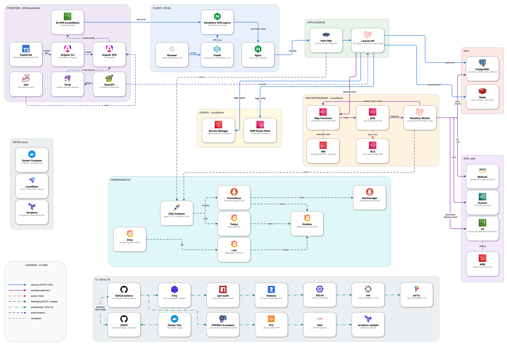

# PoC - aLittleByte
<p align="center">
  
  
  
  
  
  
</p>

<p align="center">
  <a href="https://github.com/aLittleByte-19/PoC/actions/workflows/ci.yml?query=branch%3Amain"></a>
</p>


Proof of Concept per workflow HR e documentali assistiti da AI, con generazione di comunicazioni, pipeline asincrona di elaborazione PDF, integrazione AWS-like locale e osservabilità end-to-end.


## Contesto

Questa Proof of Concept nasce nel contesto del progetto proposto da **Eggon**, orientato all’evoluzione di processi HR e documentali tramite funzionalità intelligenti, automazione operativa e integrazione con strumenti digitali già presenti nell’ecosistema aziendale.

Il lavoro si concentra su due aree applicative principali: un assistente generativo per comunicazioni HR e un Co-Pilot documentale per supportare l’elaborazione di PDF multi-destinatario. La PoC esplora come un’interfaccia web, un backend API, una pipeline asincrona, uno storage documentale e servizi AI possano cooperare in un flusso tecnico end-to-end, riproducibile in locale e osservabile durante l’esecuzione.

Il valore principale del progetto è architetturale e dimostrativo: ogni fase del processo viene resa esplicita, tracciabile e verificabile, dalla richiesta utente alla persistenza, dall’avvio del workflow alla lavorazione asincrona, fino alla raccolta di metriche, log, trace e risultati applicativi.

## Cosa dimostra la PoC

La PoC dimostra un modello applicativo composto da più livelli cooperanti:

* una **SPA Angular/TypeScript** per l’interazione operatore;
* un backend **Laravel/PHP** per API, validazione, autorizzazione, orchestrazione applicativa e persistenza;
* **PostgreSQL** per dati strutturati, stati applicativi, audit e risultati di elaborazione;
* **Redis** per cache, sessioni e rate limiting;
* storage documentale **S3-compatible** per PDF originali e sotto-documenti generati;
* **LocalStack** per emulare localmente servizi AWS come SQS, Step Functions, SSM, Secrets Manager e S3;
* **emulatore CDN locale** (Nginx) davanti al bucket S3 LocalStack per il serving della SPA Angular (in produzione: AWS CloudFront);
* integrazione AI tramite astrazione verso **Bedrock** e integrazione OCR tramite **Textract** (attivabile, disabilitata di default);
* stack di osservabilità con **OpenTelemetry, Prometheus, Grafana, Tempo, Loki, Alloy e Alertmanager**;
* CI con test backend/frontend, scansione immagini, validazione infrastrutturale e audit accessibilità.

La separazione tra richiesta HTTP e workflow asincrono è uno dei punti centrali: l’utente avvia l’elaborazione, il backend registra lo stato e il worker si occupa dei task più lunghi tramite una pipeline orchestrata.

## Architettura generale

L’architettura locale è organizzata intorno a un entrypoint edge, un layer applicativo, servizi dati, workflow asincroni e osservabilità.

Traefik gestisce l’ingresso verso i servizi esposti e instrada il traffico applicativo verso l’emulatore CDN locale. Quest’ultimo (`frontend-cloudfront`) è un secondo Nginx che emula il ruolo di una CDN/edge — non Amazon CloudFront — servendo la SPA Angular dagli oggetti caricati nel bucket S3 LocalStack e inoltrando `/api/`, `/health` e `/ready` all’Nginx applicativo/Laravel. È un container separato dall’Nginx applicativo, che è un’immagine di produzione e non deve conoscere LocalStack; quest’ultimo resta il proxy verso PHP-FPM e il percorso interno di compatibilità. PostgreSQL conserva lo stato persistente, Redis supporta componenti runtime a bassa latenza, mentre LocalStack fornisce servizi AWS-like in ambiente locale.

I worker Laravel consumano task asincroni da SQS e comunicano con Step Functions tramite callback task token. Questo permette di rappresentare una pipeline documentale composta da stati espliciti, retry, gestione errori, idempotenza e aggiornamento progressivo dello stato.



<sub>Architettura e2e</sub>

## Flusso generativo: AI Assistant

Il flusso AI Assistant supporta la generazione di comunicazioni HR a partire da un prompt, con tono e stile selezionati dall’operatore.

La richiesta parte dalla SPA e arriva alle API Laravel, dove viene validata e normalizzata. Il backend invoca il servizio AI configurato, interpreta la risposta, verifica la struttura dei dati ottenuti e registra il risultato come comunicazione applicativa. La generazione viene tracciata attraverso audit event e metriche, così da rendere osservabile l’intero processo.

Il flusso evidenzia il ruolo del backend come livello di controllo tra interfaccia e modello AI: il provider genera il contenuto, mentre l’applicazione mantiene responsabilità su validazione, persistenza, stato e tracciabilità.

## Flusso documentale: Co-Pilot CdL

Il flusso Co-Pilot documentale gestisce PDF multi-destinatario caricati dall’operatore. Dopo l’upload, il backend valida il file, registra il documento originale, salva il contenuto nello storage S3-compatible e avvia una state machine in LocalStack Step Functions.

La state machine pubblica task su SQS usando il callback pattern con task token. I worker Laravel consumano i messaggi, eseguono le fasi previste e notificano a Step Functions il completamento o il fallimento del task. Le fasi principali comprendono OCR, split logico del documento, estrazione dei dati, generazione dei sotto-documenti, aggiornamento dello stato e registrazione degli eventi applicativi.

Il risultato è una pipeline documentale composta da passaggi isolati, monitorabili e riavviabili, con persistenza dello stato e visibilità sui risultati prodotti.

## Monitoring e osservabilità

La PoC integra un layer di osservabilità locale per seguire il comportamento dell’applicazione e della pipeline documentale.

Le metriche applicative e infrastrutturali vengono raccolte tramite OpenTelemetry Collector e Prometheus. Le trace vengono inviate a Tempo, i log sono centralizzati su Loki tramite Alloy, mentre Grafana fornisce dashboard per API, workflow documentale, qualità AI/OCR, code, DLQ, log ed errori. Alertmanager completa il flusso operativo con regole collegate a runbook dedicati.

Questa impostazione rende visibili latency, traffico, errori, saturazione, stato dei worker, andamento della pipeline e qualità delle elaborazioni AI.

## CI e quality gate

La pipeline CI verifica la qualità della repository attraverso controlli backend, frontend, infrastrutturali e di sicurezza.

Il backend viene controllato con formattazione, analisi statica e test automatici. Il frontend viene verificato tramite typecheck, test, build e generazione del client API. Lo stack locale viene validato attraverso Terraform, configurazioni di osservabilità, build delle immagini, scansione Trivy, smoke test e audit di accessibilità con axe e pa11y.

La CI agisce come quality gate del progetto: ogni modifica significativa deve mantenere coerenti codice applicativo, contratto API, infrastruttura locale e comportamento osservabile dello stack.

## Setup locale

### Requisiti

* Docker e Docker Compose
* Make
* Git
* ambiente Unix-like consigliato per script e comandi di supporto

### Avvio rapido

```bash
git clone https://github.com/alittlebyte-19/PoC.git
cd PoC

make setup
```

### Verifica dello stack

```bash
make test
make logs
```

### Serving statico LocalStack

```bash
make frontend-s3-local-deploy
make frontend-cloudfront-local-url
make frontend-serving-local-test
```

Il flusso builda Angular, provisiona il bucket S3 LocalStack via Terraform, carica `apps/frontend/dist` con cache-control differenziato (`index.html` no-cache, bundle hashati immutable) e verifica il serving attraverso l’emulatore CDN locale su `https://localhost:8443`. L’emulazione valida il pattern build → bucket → distribuzione edge in locale, ma non sostituisce una CDN reale (in produzione AWS CloudFront, con TLS/OAC/edge propagation/invalidation).

Il bucket `FRONTEND_STATIC_BUCKET` è dedicato solo alla SPA. I documenti continuano a usare `POC_DOCUMENT_DISK=s3` per S3 LocalStack o `POC_DOCUMENT_DISK=real_s3` con `AWS_REAL_*` per S3/Textract reali.

### Accesso ai servizi

| Servizio     | URL                                   |
| ------------ | ------------------------------------- |
| Applicazione | `https://localhost:8443`              |
| Grafana      | `https://grafana.localhost:8443`      |
| Prometheus   | `https://prometheus.localhost:8443`   |
| Alertmanager | `https://alertmanager.localhost:8443` |
| Tempo        | `https://tempo.localhost:8443`        |
| LocalStack   | `http://127.0.0.1:4566`               |

I comandi disponibili sono raccolti nel `Makefile`, che funge da interfaccia operativa per setup, avvio, test, log, reset e controlli locali.

## Collegamento ad AWS reale

La PoC è progettata per lavorare in locale tramite LocalStack, mantenendo un modello di integrazione compatibile con servizi AWS reali. Il codice applicativo dialoga con servizi astratti tramite configurazione, endpoint e credenziali, rendendo possibile indirizzare gli stessi flussi verso ambienti cloud configurati.

Le aree predisposte per integrazione AWS reale includono:

* object storage S3 per documenti originali e sotto-documenti;
* SQS per code applicative e task asincroni;
* Step Functions per orchestrazione dei workflow;
* SSM Parameter Store per configurazione runtime;
* Secrets Manager per segreti applicativi;
* Bedrock per generazione e analisi AI;
* Textract per OCR su documenti archiviati in S3;
* SES per successive evoluzioni del dispaccio documentale.

Il passaggio a servizi reali richiede configurazione di account, regioni, IAM policy, bucket, code, state machine, segreti, parametri e permessi coerenti con l’ambiente di destinazione.

## Evoluzioni future

La struttura della PoC è predisposta per successive estensioni verso scenari più vicini a un ambiente production-like.

Le principali aree di evoluzione riguardano:

* integrazione con un identity provider centralizzato;
* hardening avanzato della gestione documentale;
* policy di retention e lifecycle sui file;
* procedure di backup e restore;
* dispatch documentale verso canali reali;
* gestione completa di ruoli, permessi e tenant;
* validazione operativa su servizi AWS reali;
* tuning di scalabilità, resilienza e monitoraggio;
* estensione dei flussi di revisione human-in-the-loop.

## Documentazione tecnica

Il punto d'ingresso è **[`docs/README.md`](docs/README.md)**, che organizza tutta la
documentazione con un percorso di lettura per chi apre il progetto la prima volta.

| Documento                                                          | Contenuto                                       |
| ----------------------------------------------------------------- | ----------------------------------------------- |
| [`docs/README.md`](docs/README.md)                                | Indice e percorso di lettura della doc          |
| [`docs/poc-scope.md`](docs/poc-scope.md)                          | Perimetro funzionale della PoC                  |
| [`docs/IMPLEMENTATION_OVERVIEW.md`](docs/IMPLEMENTATION_OVERVIEW.md) | Panoramica implementativa dell'applicativo    |
| [`docs/architecture/`](docs/architecture/)                        | Architettura, tracciabilità Capitolato, Well-Architected |
| [`docs/architecture-decisions/`](docs/architecture-decisions/README.md) | Architecture Decision Records (ADR)       |
| [`docs/runbooks/`](docs/runbooks/)                                | Runbook operativi e troubleshooting             |
| [`docs/security/`](docs/security/)                                | Identità, autorizzazione, IAM, OWASP ASVS       |
| [`openapi/v1/`](openapi/v1/)                                      | Contratto API OpenAPI                           |
| [`infra/localstack/`](infra/localstack/)                          | Terraform e risorse AWS-like locali             |
| [`docker/`](docker/)                                              | Configurazioni runtime, edge e osservabilità    |
| [`.github/workflows/`](.github/workflows/)                        | Pipeline CI e quality gate                      |
