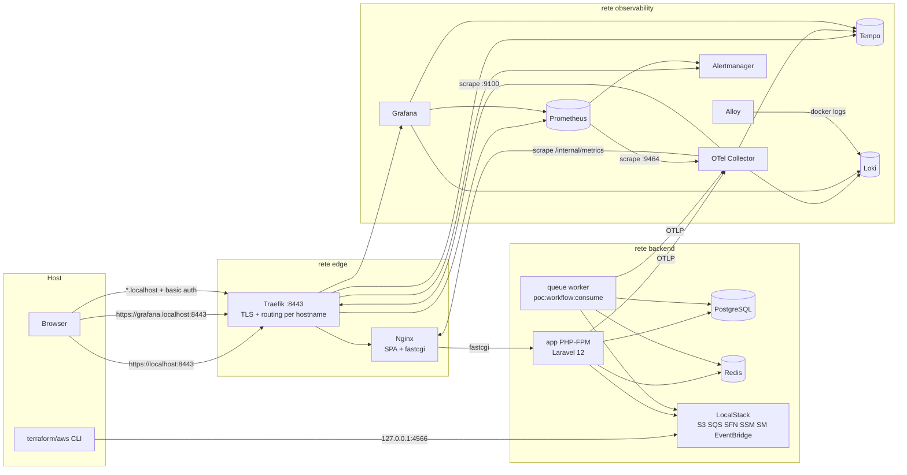

# Panoramica implementativa dell'applicativo

> Documento aggiornato tramite analisi diretta della codebase.
> Branch analizzato: `docs/finalizza_documentazione`.
> Ultimo aggiornamento: 2026-06-14.

---

## 1. Executive summary tecnico

L'applicativo è una PoC di **pipeline documentale HR assistita da AI** composta da due moduli funzionali: un **AI Assistant** che genera comunicazioni aziendali a partire da un prompt (tono e stile vincolati), e un **Co-Pilot CdL** che riceve PDF di qualsiasi tipologia, ne riconosce tipo e destinatari (sempre almeno uno) dal testo OCR tramite LLM, li separa in sotto-documenti per destinatario, ne estrae campi strutturati e ne traccia lo stato di lavorazione con una confidenza calcolata su leggibilità OCR e completezza dei campi.

Il backend è **Laravel 12 / PHP 8.4** con PostgreSQL e Redis; il frontend è una **SPA React 19 + TypeScript** costruita con Vite e servita da Nginx dietro **Traefik** (unico entrypoint TLS). L'elaborazione documentale è asincrona: una **state machine AWS Step Functions** (emulata in LocalStack) orchestra i task via **SQS con callback task token**, consumati da un worker Laravel dedicato. Le integrazioni AI usano **AWS Bedrock** (classificazione/split ed estrazione campi sul testo OCR, generazione comunicazioni — tutte chiamate solo-testo via Converse) e **AWS Textract** per l'OCR che alimenta la pipeline documentale (necessario per l'analisi, attivabile solo con S3 reale). La configurazione runtime arriva da **SSM Parameter Store + Secrets Manager**, caricata prima del boot di Laravel.

L'osservabilità è il tratto più maturo della PoC: metriche golden-signal e di dominio esposte in formato Prometheus, trace OTLP verso Tempo, log dei container verso Loki via Alloy, 10 alert rule, 5 dashboard Grafana provisioned e runbook collegati. La CI (GitHub Actions) copre lint, analisi statica, test backend e frontend, scansione Trivy delle immagini, validazione Terraform e audit di accessibilità axe/pa11y contro lo stack reale.

Il livello di maturità è **alto per una PoC**: confini architetturali chiari, validazione input sistematica, idempotenza nel workflow, audit trail, hardening container e di rete. Non è production-ready per scelta dichiarata di scope: mancano IdP reale, invio email, gestione segreti non-default e ridondanza operativa (dettagli in §17–19).

---

## 2. Perimetro dell'analisi

L'analisi si basa sullo **stato attuale del codice**: route, controller, service, migration, configurazioni Docker/Traefik/Terraform, workflow CI, script operativi e test sono stati letti direttamente. I file Markdown preesistenti (README, runbook, guideline) sono stati usati solo come contesto secondario; ogni affermazione tecnica rilevante in questo documento è ancorata a un path verificato. Dove una funzionalità risulta solo predisposta o simulata, è dichiarato esplicitamente. Non viene descritta la storia delle modifiche: solo ciò che esiste ora.

---

## 3. Mappa della codebase

| Area | Path | Responsabilità |
|---|---|---|
| Backend applicativo | `app/` | Controller HTTP, middleware, model, console command |
| Domini PoC | `app/Copilot/` | Service layer per dominio: `Ai/` (Bedrock), `Ocr/` (Textract), `Documents/`, `Workflow/`, `Identity/`, `Audit/`, `Observability/`, `Support/` |
| Route | `routes/api.php`, `routes/web.php` | API v1 + endpoint di sistema |
| Schema dati | `database/migrations/` | 6 tabelle di dominio + indici/FK |
| Frontend SPA | `apps/frontend/` | React 19 + TS + Vite, client API generato |
| Contratto API | `openapi/v1/alittlebyte-poc-api.yaml` | OpenAPI 3.1, fonte del client frontend |
| Infrastruttura locale | `docker-compose.yml`, `docker/` | 19 servizi: app, worker, nginx, traefik, datastore, stack osservabilità, tool |
| Infrastruttura AWS (emulata) | `infra/localstack/` | Terraform: SQS+DLQ, S3+KMS, SSM, Secrets Manager, EventBridge, IAM, Step Functions, SES identity |
| State machine | `infra/localstack/state-machines/document-pipeline.asl.json` | Definizione ASL della pipeline documentale |
| Osservabilità | `docker/otel-collector/`, `docker/prometheus/`, `docker/grafana/`, `docker/loki/`, `docker/alloy/`, `docker/tempo/`, `docker/alertmanager/` | Collector, scrape, alert rule, dashboard, log shipping |
| CI | `.github/workflows/ci.yml`, `mirror-images.yml`, `scripts/ci/` | Pipeline unica a 4 job + mirroring immagini su GHCR |
| Test | `tests/` (10 file, 34 casi Pest), `apps/frontend/src/**/*.test.tsx` (5 file Vitest) | Feature + Unit backend, component test frontend |
| Audit a11y | `scripts/a11y/axe-playwright.mjs`, `pa11y-runner.mjs` | Audit automatici contro lo stack reale |
| Operatività | `Makefile`, `docs/runbooks/` | Setup riproducibile, comandi verifica, runbook per alert |
| TLS locale | `scripts/tls/generate-local-cert.sh` | Cert self-signed con SAN `*.localhost` (artefatto runtime, gitignored) |

---

## 4. Architettura generale

Tre reti Docker segmentate per least privilege (`docker-compose.yml`, blocco `networks:` in coda al file):

- **edge**: Traefik ↔ Nginx, più i container di audit frontend;
- **backend**: app PHP-FPM, worker queue, Postgres, Redis, LocalStack, Terraform, e l'OTel Collector per l'ingest;
- **observability**: collector, Prometheus, Tempo, Loki, Alloy, Alertmanager, Grafana; Traefik vi partecipa solo per instradare le dashboard e per esporre le proprie metriche.

Le uniche porte pubblicate sull'host sono Traefik `8080/8443` (la 8080 redirige globalmente su HTTPS, `docker/traefik/traefik.yml`) e LocalStack su `127.0.0.1:4566`. Postgres, Redis e tutte le UI di osservabilità non espongono porte host.



Confini di responsabilità: Traefik termina TLS e applica auth alle dashboard; Nginx serve la SPA e inoltra `/api/` a PHP-FPM; Laravel gestisce validazione, identità, persistenza e orchestrazione; Step Functions (LocalStack) detiene lo stato del workflow; il worker esegue i task e risponde con i task token; il collector è l'unico punto di raccolta telemetria.

---

## 5. Tecnologie rilevate e ruolo nel sistema

### Laravel 12 / PHP 8.4 (backend)

**Dove**: `composer.json`, `app/`, `bootstrap/app.php`, `docker/php/Dockerfile` (`FROM php:8.4-fpm-bookworm`).
**Ruolo**: API REST stateless, validazione (FormRequest), ORM Eloquent, console worker, exception mapping centralizzato (`bootstrap/app.php:64-149` — ogni errore esce come JSON con `code`, `message`, `requestId`, `correlationId`).
**Motivazione**: framework maturo con primitive pronte per validazione, queue, storage astratto (flysystem) e testing; coerente con lo stack del team.
**Valutazione**: buona separazione controller→service (i controller orchestrano, la logica vive in `app/Copilot/*`); error handling uniforme; niente logica nei model oltre a cast/relazioni.
**Best practice**: la struttura segue le convenzioni Laravel ufficiali; il mapping degli errori con correlation ID è in linea con le raccomandazioni API di OWASP ASVS (V7, error handling senza leak di dettagli interni).

### PostgreSQL 16

**Dove**: `docker-compose.yml` (servizio `postgres`, `postgres:16-alpine`), `config/database.php:91`, `database/migrations/`.
**Ruolo**: persistenza di comunicazioni, documenti, sotto-documenti, dati estratti, audit trail e task di workflow.
**Motivazione**: vincoli CHECK sugli stati, JSON nativo per payload e metadata, FK con cascade — tutte feature usate realmente nelle migration.
**Valutazione**: schema con indici mirati (es. `(tenant_id, processing_status)` su `original_documents`), FK `cascadeOnDelete` su `sub_documents`/`extracted_data`, unique su `task_token_hash`. Nessuna porta host esposta. Limite: multi-tenancy solo applicativa (vedi §7).

### Redis 7

**Dove**: `docker-compose.yml` (servizio `redis`), `config/database.php:161-189`, `config/cache.php`.
**Ruolo**: cache, sessioni e contatori di rate limiting.
**Motivazione**: i throttle per-route (`routes/api.php`) richiedono uno store condiviso tra i processi PHP-FPM.
**Valutazione**: hardening sopra la media per una PoC — `requirepass`, `maxmemory 256mb` con policy `volatile-lru` scelta consapevolmente (il commento nel compose spiega che `allkeys-lru` azzererebbe i rate limit evictando chiavi senza TTL), healthcheck autenticato via `REDISCLI_AUTH` senza password in argv, nessuna porta host.

### React 19 + TypeScript 5.7 + Vite 6 (frontend)

**Dove**: `apps/frontend/package.json`, `apps/frontend/src/`.
**Ruolo**: SPA a vista singola con switcher (`PocView`: `overview | assistant | copilot`, `src/app/routes.tsx`), pannelli per generazione comunicazioni, upload documenti, storici e metriche.
**Motivazione**: SPA leggera senza routing complesso; Vite per build veloce e proxy dev verso l'entrypoint TLS (`apps/frontend/vite.config.ts`).
**Valutazione**: data fetching uniforme con TanStack React Query 5 (unico QueryClient, `src/app/AppProviders.tsx`), stati loading/error/empty espliciti (`components/feedback/`, con `aria-live`), dark mode via token CSS (`src/styles/tokens.css`, `data-poc-theme` + `prefers-color-scheme`). Limite: la vista attiva non è nell'URL → niente deep linking né history.

### OpenAPI 3.1 + Orval (contratto API)

**Dove**: `openapi/v1/alittlebyte-poc-api.yaml`, `apps/frontend/orval.config.ts`, output in `src/api/generated/`.
**Ruolo**: contract-first — il client TypeScript del frontend è generato dal contratto; la CI lo lint-a con Redocly e **fallisce se il client generato non è committato** (`ci.yml`, step "Check generated client is committed").
**Motivazione**: elimina la deriva tra backend e frontend sui tipi delle risposte.
**Valutazione**: ottima scelta per manutenibilità; il wrapper `src/api/pocApi.ts` centralizza il controllo di successo (`assertApiSuccess`). Gap: il contratto non è validato a runtime contro le risposte reali del backend (nessun contract test automatico lato Laravel oltre a `HealthAndApiContractTest`).

### Traefik v3.4 (edge router)

**Dove**: `docker/traefik/traefik.yml`, `docker/traefik/dynamic/http.yml`, `docker/traefik/usersfile`.
**Ruolo**: unico entrypoint: TLS, redirect globale HTTP→HTTPS, routing per hostname (`localhost`/`poc.localhost` → nginx; `grafana|prometheus|alertmanager|tempo.localhost` → rispettivi servizi), basic auth (htpasswd bcrypt) sulle UI prive di autenticazione nativa, metriche Prometheus su entrypoint dedicato `:9100`, dashboard API disabilitata.
**Motivazione**: riproduce in piccolo il pattern di produzione (edge unico, servizi interni mai esposti) e rende la PoC dimostrabile in LAN senza aprire porte sensibili.
**Valutazione**: configurazione pulita e minimale; TLS ≥1.2; access log JSON. La basic auth è dichiaratamente una soluzione da PoC (in produzione: forward-auth/OIDC o non-esposizione, vedi §13).

### Nginx 1.27 (static + fastcgi)

**Dove**: `docker/nginx/Dockerfile` (multi-stage: build SPA con node:22 → runtime `nginx:1.27-alpine`, `USER nginx`), `docker/nginx/default.conf`.
**Ruolo**: serve la SPA con fallback `try_files ... /index.html`, inoltra `/api/` e gli endpoint di sistema a PHP-FPM, applica security header (X-Frame-Options, X-Content-Type-Options, Referrer-Policy, Content-Security-Policy).
**Dettaglio rilevante**: `/internal/metrics` non è servito dal listener edge `:8080` usato da Traefik; ritorna 404 dall'esterno. Lo scrape passa dal listener interno `nginx:8081/internal/metrics`, raggiungibile solo sulle reti Docker interne. La CI verifica sia il 404 esterno sia la raggiungibilità interna.
**Gap**: la CSP è locale e mirata alla SPA attuale; eventuali nuovi asset remoti o embedding esterni richiedono aggiornamento esplicito della policy.

### AWS Bedrock (LLM)

**Dove**: `app/Copilot/Ai/BedrockService.php` (client `BedrockRuntimeClient` costruito in `AppServiceProvider` con timeout 300s), config in `config/services.php` (`model_id`, `region`, `endpoint`, credenziali AWS reali opzionali; default modello `amazon.nova-lite-v1:0` da `docker-compose.yml`).
**Ruolo**: tre operazioni — `generateCommunication()` (JSON `{title, body}` da prompt+tono+stile), `splitDocument()` (segmenti per destinatario dal testo OCR), `extractFields()` (campi strutturati dal testo OCR; la confidenza effettiva è calcolata a valle su leggibilità OCR e completezza dei campi). Tutte le chiamate sono solo-testo via Converse.
**Valutazione**: parsing difensivo dell'output LLM (estrazione JSON da fence markdown con fallback regex, normalizzazione campi in `normalizeSplitResponse()`), errori AWS mappati su `AiServiceException` → 502 con messaggio user-friendly, metriche di fallimento dedicate (`BedrockFailureRateHigh` alert).
**Gap**: l'output del modello non è validato contro uno schema rigido (solo normalizzazione); nessuna mitigazione esplicita di prompt injection veicolata dal contenuto del PDF; nessun circuit breaker (solo retry SDK).

### AWS Textract (OCR, opzionale)

**Dove**: `app/Copilot/Ocr/Services/TextractService.php`, flag `TEXTRACT_ENABLED` (`config/services.php`).
**Ruolo**: OCR asincrono (`startDocumentTextDetection` + polling con timeout configurabile), confidence media, testo salvato su `original_documents.ocr_text` e per pagina su `original_documents.ocr_pages` (usato da split ed estrazione).
**Dettaglio rilevante**: guard architetturale in `DocumentWorkflowService::start()` — se Textract è abilitato ma il disco documenti non è `real_s3`, il workflow rifiuta di partire con errore esplicito (Textract reale non può leggere il bucket LocalStack). È un esempio concreto di fail-fast su configurazioni incoerenti.
**Stato**: implementato ma **disabilitato di default** (`TEXTRACT_ENABLED=false`); con flag off il task ritorna `enabled=false` e la pipeline prosegue.

### AWS Step Functions + SQS (workflow asincrono)

**Dove**: `infra/localstack/state-machines/document-pipeline.asl.json`, `infra/localstack/main.tf` (state machine, coda + DLQ, IAM role/policy, EventBridge), `app/Copilot/Workflow/Services/DocumentWorkflowService.php`, `DocumentWorkflowTaskHandler.php`, `app/Console/Commands/ConsumeWorkflowTasks.php`.
**Ruolo**: la state machine usa il **callback pattern** (`arn:aws:states:::sqs:sendMessage.waitForTaskToken`): ogni stato pubblica su SQS un messaggio con task token e tipo (`textract.ocr`, `bedrock.extract`, `persist.results`, `dispatch.domain_event`); il worker Laravel esegue e risponde con `sendTaskSuccess/Failure`. Retry dichiarativi nello ASL (2 tentativi, backoff 2x), timeout per stato (420s Textract, 720s Bedrock), `Catch` → stato `Failed`.
**Motivazione**: separa lo stato del workflow dall'esecutore; i task pesanti (LLM, OCR) escono dal ciclo HTTP; la DLQ cattura i messaggi non processabili.
**Valutazione**: **idempotenza reale** — `document_workflow_tasks.task_token_hash` (SHA-256, unique) deduplica i re-delivery SQS e un task già `succeeded/skipped` ritorna il risultato cached senza rieseguire. **Heartbeat implementato**: l'ASL dichiara `HeartbeatSeconds` per ogni task (180s Textract, 240s Bedrock, 90s persist/dispatch) e il worker invia `SendTaskHeartbeat` tramite `WorkflowTaskHeartbeat` durante il polling Textract e tra i segmenti Bedrock (`TextractService`, `DocumentProcessingService`); un heartbeat rifiutato degrada a no-op senza abortire il task di business. È il punto più sofisticato del backend.
**Gap vs best practice AWS** ([Step Functions best practices](https://docs.aws.amazon.com/step-functions/latest/dg/sfn-best-practices.html)): in compose gira una sola replica del worker (`restart: unless-stopped`), anche se il design è già concorrenza-safe (claim atomico via `task_token_hash` + `POC_WORKFLOW_CLAIM_TTL_SECONDS`, `visibility_timeout_seconds` SQS 900s > timeout ASL massimo 720s); in LocalStack il comportamento di SFN non è identico ad AWS (Express vs Standard, quota, exactly-once non garantito).

### LocalStack 4.5 + Terraform 1.10

**Dove**: `docker-compose.yml` (servizio `localstack`, servizi emulati: `s3,sqs,stepfunctions,ssm,secretsmanager,events,ses,iam,sts,logs`), `infra/localstack/*.tf`.
**Ruolo**: emula AWS in locale; Terraform provisiona S3 (con SSE-KMS e public access block), SQS+DLQ, SSM parameter, secret JSON, EventBridge bus+rule (predisposti per gli eventi terminali della pipeline ma non esercitati: l'app non pubblica eventi), IAM role per SFN, identità SES.
**Motivazione**: l'app parla con AWS vero o emulato **senza cambiare codice** — cambiano solo endpoint e credenziali. Il provisioning è codificato, ripetibile e validato in CI (`terraform fmt -check`, `init`, `validate`).
**Valutazione**: buona fedeltà al deployment reale (KMS, public access block, IAM, bus EventBridge e identità SES sono configurati ma non applicati/esercitati a runtime: LocalStack non valuta le policy IAM e l'app non pubblica eventi né invia email); lo stato Terraform è locale e committato (`terraform.tfstate` nel repo — accettabile solo perché contiene risorse fake).

### SSM Parameter Store + Secrets Manager (config runtime)

**Dove**: `app/Copilot/Support/RuntimeConfigurationLoader.php`, agganciato in `bootstrap/app.php:25` **prima** del caricamento env di Laravel; bootstrap minimo via `CONFIG_*` env (`docker-compose.yml`, anchor `x-backend-environment`).
**Ruolo**: con `CONFIG_SOURCE=aws` la configurazione applicativa (APP_KEY, credenziali DB/Redis, code, bucket, model id…) viene letta da `getParametersByPath` (con decryption) + `getSecretValue`, popolata in `$_ENV` e **cachata su file con fingerprint** (`bootstrap/cache/runtime-config.php`) per non chiamare AWS a ogni richiesta PHP-FPM. Chiavi obbligatorie asserite a bootstrap (fail-fast).
**Motivazione**: implementa il principio [Twelve-Factor config](https://12factor.net/config) e simula il pattern di produzione (nessun segreto applicativo nel filesystem dell'immagine); i container ricevono solo le credenziali di bootstrap.
**Valutazione**: design production-like raro in una PoC. Gap: la cache su file non ha invalidazione runtime (serve riavvio o cancellazione cache per rotazione segreti).

### OpenTelemetry Collector + Prometheus + Tempo + Loki + Alloy + Grafana + Alertmanager

**Dove**: `docker/otel-collector/config.yml`, `docker/prometheus/{prometheus.yml,rules/}`, `docker/tempo/`, `docker/loki/`, `docker/alloy/config.alloy`, `docker/grafana/{provisioning,dashboards}/`, `docker/alertmanager/`.
**Ruolo e flusso**: il collector è l'**unico punto di raccolta** — riceve OTLP (gRPC/HTTP) da app e worker, scrappa `/internal/metrics` via nginx e le metriche Traefik `:9100`, e re-espone tutto su `:9464` dove Prometheus fa un solo scrape. Trace → Tempo (OTLP), log applicativi → Loki (ingestion OTLP nativa di Loki 3.x); Alloy raccoglie i log dei container (filtrati per label compose project) e li spedisce a Loki. Grafana ha datasource provisioned da file (Prometheus/Tempo/Loki, non editabili) e 5 dashboard versionate: `api-golden-signals`, `document-pipeline`, `ai-ocr-quality`, `queues-and-dlq`, `logs-and-errors`.
**Alerting**: 10 regole in 4 file (`docker/prometheus/rules/`): `WorkerDown`, `DocumentStuckInProcessing`, `StepFunctionExecutionFailed`, `TextractFailureRateHigh`, `BedrockFailureRateHigh`, `TargetDown`, `APIHighErrorRate`, `APIHighLatencyP95`, `QueueBacklogHigh`, `DLQNotEmpty` — ognuna rimanda a un runbook in `docs/runbooks/`.
**Motivazione**: copre i [quattro golden signal SRE](https://sre.google/sre-book/monitoring-distributed-systems/) (latency, traffic, errors, saturation) più le metriche di dominio della pipeline.
**Valutazione**: architettura corretta (un solo collettore, processori `memory_limiter`+`batch`, config validate in CI con `promtool` e `otelcol validate` via `make observability-config`). Gap: niente retention/SLO formalizzati; Alertmanager senza receiver reali (routing demo).

### Metriche applicative custom

**Dove**: `app/Copilot/Observability/MetricsRecorder.php` + `PrometheusExporter.php`, endpoint `/internal/metrics`, volume compose `observability-metrics` condiviso tra `app` e `queue`.
**Ruolo**: counter e histogram HTTP (bucket espliciti 5ms→10s) e counter di dominio (`textract_jobs_*`, `stepfunctions_executions_*`, `sqs_messages_*`) persistiti su JSON con file locking; il volume condiviso fa sì che le metriche registrate dal worker raggiungano l'exporter scrappato via nginx.
**Valutazione**: soluzione pragmatica e funzionante senza dipendenze aggiuntive. Limite tecnico: il file JSON con lock è un single-writer bottleneck e non scala oltre un host; la soluzione canonica in produzione è un sidecar/exporter dedicato o push OTLP delle metriche di dominio.

### Docker Compose + hardening container

**Dove**: `docker-compose.yml`, `docker/php/Dockerfile`, `docker/php/security.ini`, `docker/nginx/Dockerfile`.
**Punti verificati**: utenti non-root (`USER www-data` PHP, `USER nginx`); `apt-get upgrade`/`apk upgrade` ad ogni build; `security.ini` con `expose_php=Off`, `display_errors=Off`, `allow_url_fopen/include=Off`, cookie di sessione `httponly+secure+samesite=Strict`, `disable_functions` (exec, system, shell_exec…); immagini base da mirror ECR public per evitare rate limit Docker Hub; healthcheck su tutti i servizi critici; `tls-tool` con `network_mode: none` (genera solo file).

### CI — GitHub Actions

**Dove**: `.github/workflows/ci.yml` (4 job), `mirror-images.yml`, `scripts/ci/`.
**Pipeline**: `backend` (Pint, Larastan, Pest), `frontend` (lint OpenAPI, generazione client + check committed, typecheck, Vitest, build, `npm audit --audit-level=high`), `stack` (mirroring/caching immagini, `terraform fmt/validate`, validazione config osservabilità, build immagini dev+prod, **Trivy** `--exit-code 1 --severity HIGH,CRITICAL` su app e nginx, avvio stack completo con LocalStack+Terraform apply, smoke HTTPS via Traefik inclusi i check 401 sulle dashboard, audit axe e pa11y contro lo stack reale), `publish` (push GHCR, solo non-PR). Concurrency con cancel-in-progress.
**Valutazione**: copertura larga e realistica (lo smoke testa il sistema integrato, non i mock); il quality gate include sicurezza (Trivy, npm audit) e accessibilità. Gap: niente coverage report; i job non pubblicano artefatti di debug in caso di fallimento smoke.

---

## 6. Flussi applicativi principali

### 6.1 Generazione comunicazione HR (implementato)

1. `POST /api/v1/communications` (throttle 20/min) → middleware `poc.identity` (risolve `PocUser` da config locale o trusted header) e `poc.authorize` (tenant + ruolo `poc-operator|poc-admin`).
2. `GenerateCommunicationRequest` valida `prompt` (12–5000 char), `tone` e `style` su whitelist chiuse.
3. `CommunicationController::store()` → `BedrockService::generateCommunication()` → parsing/normalizzazione JSON.
4. Persistenza `Communication` con stato `Draft`; audit event `poc-communication-generated` (con request/correlation ID).
5. Risposta 201 con la comunicazione e lo stato attore aggiornato; su errore AWS → 502 `upstream_unavailable`.
6. Frontend: `useGenerateCommunication` (mutation React Query) invalida lo stato e mostra la bozza.

**Test**: `CommunicationStorageTest`, `BedrockServiceTest` (parsing), `HealthAndApiContractTest`.

### 6.2 Pipeline documentale (implementato, con orchestrazione simulata in LocalStack)

```mermaid
sequenceDiagram
    participant FE as SPA (EventSource)
    participant API as Laravel API
    participant S3 as S3 (LocalStack)
    participant SFN as Step Functions
    participant SQS as SQS task queue
    participant W as Worker (poc:workflow:consume)
    participant BR as Bedrock

    FE->>API: POST /api/v1/documents/ocr (PDF)
    API->>API: UploadDocumentRequest (MIME, size, pagine via Fpdi, path traversal)
    API->>S3: store documents/originals/...
    API->>SFN: startExecution (document_id, s3 key, correlation_id)
    API-->>FE: 202 + streamUrl
    FE->>API: GET /documents/{id}/stream (SSE)
    SFN->>SQS: textract.ocr + taskToken (waitForTaskToken)
    W->>SQS: long polling (wait 10s)
    W->>W: dedup su task_token_hash (idempotente)
    W-->>SFN: sendTaskSuccess
    SFN->>SQS: bedrock.extract + taskToken
    W->>BR: splitDocument(testo OCR) → segmenti per destinatario
    W->>W: Fpdi: estrae pagine → SubDocument per segmento
    W->>BR: extractFields(testo OCR destinatario) → ExtractedData; confidenza calcolata
    W-->>SFN: sendTaskSuccess
    SFN->>SQS: persist.results, poi dispatch.domain_event
    W-->>SFN: sendTaskSuccess (status → Completed)
    API-->>FE: SSE event "document" per ogni sub-doc, poi "done"
```

Error handling: retry ASL (2 tentativi, backoff 2x) e `Catch`→`Failed`; `sendTaskFailure` dal worker; stato `Failed` con `workflow_failure_reason` e `error_message`; alert `StepFunctionExecutionFailed` e `DocumentStuckInProcessing`. **Test**: `DocumentUploadTest`, `DocumentWorkflowTest`, `DocumentExtractionTest`.

### 6.3 Preview/cancellazione sotto-documenti (implementato)

`GET /documents/{subDocument}/preview` streamma il PDF inline (`Storage::readStream`); `DELETE /documents/{subDocument}` rimuove file e record (e l'originale se senza split residui). Autorizzazione per match `tenant_id` tra documento e attore.

### 6.4 Stato attore e storici (implementato)

`GET /api/v1/state` → `PocStateService::forActor()`: storico comunicazioni, documenti con sotto-documenti e dati estratti, metriche di qualità. Il frontend lo consuma come unica query (`usePocState`).

### 6.5 Revisione/approvazione comunicazioni (predisposto, non completo)

Lo stato `approved` esiste a livello di enum, vincolo CHECK in migration e test (`CommunicationApprovalTest` valida la transizione **a livello di model**), ma **non esiste alcun endpoint API** per approvare o scartare: `routes/api.php` espone solo generazione e lettura. Il flusso UI "Revisione" mostra le bozze ma la transizione di stato non è invocabile via API.

### 6.6 Invio comunicazioni / email (assente, predisposizione minima)

`sub_documents.send_status` (`pending|sent`) e l'identità SES in Terraform esistono, ma non c'è alcun codice di invio. SES è dichiaratamente fuori scope PoC.

### 6.7 OCR Textract (implementato, disabilitato di default)

Flag off → il task `textract.ocr` ritorna `enabled=false` e la pipeline prosegue con il solo Bedrock. Con flag on, la guard richiede `real_s3` (vedi §5).

---

## 7. Persistenza, stato e modello dati

Sei tabelle di dominio (`database/migrations/`):

| Tabella | Chiavi/indici notevoli | Note |
|---|---|---|
| `communications` | indice su `status`; CHECK su stati (`draft`, `approved`, `discarded`) | stato castato a enum PHP `CommunicationStatus` |
| `original_documents` | `(tenant_id, processing_status)`, `workflow_execution_arn`, `textract_job_id` | colonne workflow (arn, started/completed/failed_at, failure_reason), OCR (job id, testo, confidence), `s3_bucket/s3_key` |
| `sub_documents` | FK cascade su original, indici su FK e `send_status` | range pagine, stato invio |
| `extracted_data` | FK **unique** cascade su sub_document | 1:1 con sotto-documento; confidence 0–100 |
| `audit_events` | `(tenant_id, event_type)`, `(resource_type, resource_id)`, `created_at` | append-only (nessun `updated_at`), metadata JSON |
| `document_workflow_tasks` | `task_token_hash` char(64) **unique**; `(original_document_id, task_type)`, `(status, task_type)` | input/output payload JSON, stati pending→running→succeeded/skipped/failed |

Gli stati applicativi sono enum PHP con cast Eloquent (`ProcessingStatus`, `SendStatus`, `CommunicationStatus`) duplicati come CHECK a livello DB: doppia difesa coerente. Le relazioni Eloquent rispecchiano le FK.

**Punti da rafforzare in ottica production**: multi-tenancy garantita solo da `where tenant_id` applicativi (nessun Postgres Row-Level Security); nessuna strategia di migrazione dati/rollback documentata; niente backup/PITR (accettabile in PoC, bloccante in produzione); `ocr_text` longText cresce senza retention.

---

## 8. Gestione file, storage e documenti

**Acquisizione**: upload multipart `POST /documents/ocr`. `UploadDocumentRequest` valida: MIME `application/pdf` (validazione Laravel basata su fileinfo, quindi sul contenuto e non solo sull'estensione), dimensione massima da config (`poc.document_limits.max_upload_mb`, default 20MB), numero massimo pagine (50) **leggendo realmente il PDF con Fpdi** (che funge anche da verifica strutturale del formato), check anti path-traversal sul filename, limiti Textract se abilitato.

**Storage**: dischi flysystem configurabili (`POC_DOCUMENT_DISK`: `local`, `s3` LocalStack, `real_s3`); path generati server-side (`documents/originals/...`, split: `documents/sub/{original_id}_{slug}_{range}_{uuid}.pdf` — il nome utente non finisce mai nel path). Nel DB si salva solo il path disk-relative; bucket S3 con SSE-KMS e public access block da Terraform.

**Fruizione**: preview via `Storage::readStream` con `Content-Disposition: inline` e autorizzazione tenant; nessun URL firmato (i file non sono mai raggiungibili direttamente).

**Confronto con [OWASP File Upload Cheat Sheet](https://cheatsheetseries.owasp.org/cheatsheets/File_Upload_Cheat_Sheet.html)**: presenti validazione contenuto+estensione, limite dimensione, nomi generati server-side, storage fuori dal webroot — il grosso delle raccomandazioni. Mancano per un contesto reale: scansione antivirus/sandbox, CDR per neutralizzare JavaScript/azioni embedded nei PDF (OWASP la raccomanda esplicitamente per i formati PDF), e rate limiting dedicato sull'upload oltre al throttle generico. Rischio residuo concreto: un PDF malevolo viene comunque inoltrato a Textract, archiviato su S3 e ri-servito in preview ad altri operatori (a Bedrock arriva solo il testo OCR estratto, non il PDF).

---

## 9. Elaborazione asincrona, code e workflow

Già descritto in §5/§6.2; sintesi valutativa:

| Aspetto | Stato | Evidenza |
|---|---|---|
| Separazione dal ciclo HTTP | ✅ | upload risponde 202, lavoro nel worker |
| Retry/backoff | ✅ dichiarativi | ASL: 2 attempts, backoff 2x, per-stato |
| Timeout | ✅ per stato | 420s/720s in ASL; polling Textract con timeout proprio |
| Idempotenza | ✅ reale | `task_token_hash` unique + risultato cached |
| DLQ | ✅ | `aws_sqs_queue.documents_dlq` + alert `DLQNotEmpty` |
| Long polling | ✅ | `WaitTimeSeconds` 10s nel consumer |
| Heartbeat | ✅ | `HeartbeatSeconds` nell'ASL + `SendTaskHeartbeat` via `WorkflowTaskHeartbeat` (Textract/Bedrock) |
| Concorrenza-safe | ✅ design | claim atomico `task_token_hash` + `POC_WORKFLOW_CLAIM_TTL_SECONDS`; `visibility_timeout` 900s > timeout ASL |
| Scaling worker | ⚠️ | in compose gira una sola replica (`restart: unless-stopped`), nessun autoscaling |
| Osservabilità job | ✅ | counter sqs/stepfunctions + dashboard `queues-and-dlq`, `document-pipeline` |

In produzione servirebbero: più repliche del worker con visibilità SQS calibrata (il design è già concorrenza-safe, manca solo lo scaling effettivo) e una policy di redrive dalla DLQ. L'heartbeat per i task lunghi — raccomandazione esplicita [AWS](https://docs.aws.amazon.com/step-functions/latest/dg/sfn-best-practices.html) — è già implementato.

---

## 10. Integrazioni AI, OCR e servizi esterni

Coperte in §5 (Bedrock, Textract) e §6. Punti trasversali:

- **Astrazione**: i client AWS sono costruiti centralmente in `AppServiceProvider` con endpoint/credenziali da config → lo switch LocalStack/AWS reale è solo configurativo. Le credenziali "reali" (`AWS_REAL_*`, `TF_VAR_real_*`) sono separate da quelle fake di LocalStack.
- **Niente mock nel codice di produzione**: la "simulazione" sta nell'infrastruttura (LocalStack), non in branch condizionali applicativi — scelta che mantiene il codice identico tra demo e produzione. L'unico flag comportamentale è `TEXTRACT_ENABLED`.
- **Privacy**: i PDF (potenzialmente con dati personali di dipendenti) transitano verso Textract e l'object storage, e il relativo testo OCR verso Bedrock; non c'è anonimizzazione né data-retention policy. In PoC con dati finti va bene; in produzione richiede DPA/regione EU e una policy di retention su `ocr_text` ed `extracted_data`.
- **Error handling**: eccezioni AWS → log strutturato + 502 con messaggio amichevole; mai stack trace al client.

---

## 11. Frontend e interazione utente

Coperto in §5; valutazione sintetica:

- **Solido**: data layer uniforme (React Query + client generato), feedback espliciti (loading con `aria-live`, error, empty), SSE per progress reale dell'elaborazione (`useDocumentUpload` con EventSource), design token centralizzati con dark mode, test component (5 file Vitest) e audit a11y automatizzati in CI con **zero violazioni** axe/pa11y correnti.
- **Limiti**: niente router → stato di navigazione non condivisibile/bookmarkabile; copertura test frontend limitata ai componenti principali; nessun error boundary globale documentato; bundle unico senza code splitting (accettabile per 3 viste).

---

## 12. API, routing e backend applicativo

- **Stile**: REST pragmatico sotto `/api/v1` con naming coerente e versioning nel path; risposte JSON uniformi; errori con `code` macchina-leggibile + `requestId`/`correlationId` (correlazione propagata dal middleware `CorrelateRequests`).
- **Validazione**: sempre via FormRequest, whitelist chiuse per valori enumerabili.
- **Middleware chain**: `poc.identity` → `poc.authorize` → `throttle` (60/min lettura, 20/min operazioni costose: generazione AI e upload).
- **Service layer**: i domini vivono in `app/Copilot/{Ai,Ocr,Documents,Workflow,Identity,Audit,Observability}` — confini netti, dipendenze inject-ate, nessun helper globale.
- **SSE**: lo stream `documents/{id}/stream` ha timeout esplicito (300s) e eventi tipizzati (`document`, `done`, `error`).
- **Da rifattorizzare/completare**: endpoint di transizione stato comunicazioni (oggi mancante, §6.5); il throttle è per-IP/attore generico, non differenziato per tenant.

---

## 13. Sicurezza

**Adeguato per PoC** (e dichiarato come tale), **non per produzione**:

| Controllo | Stato | Evidenza |
|---|---|---|
| Autenticazione | ⚠️ simulata | `ResolvePocIdentity`: identità da config locale o trusted header (`X-Poc-*`). Nessun IdP: chiunque raggiunga l'API nel mode `trusted_headers` può forgiare gli header se non c'è un gateway che li firma. Fuori scope dichiarato. |
| Autorizzazione | ✅ per PoC | RBAC (`poc-operator`/`poc-admin`) + tenant check su ogni risorsa (`AuthorizePocAccess`, check nei controller) |
| Audit | ✅ | `audit_events` append-only con actor, resource, request/correlation id |
| Input validation | ✅ | FormRequest sistematici, whitelist, validazione PDF reale (§8) |
| Rete | ✅ | 3 reti segmentate, niente porte host se non Traefik e LocalStack loopback; redirect HTTPS globale; TLS ≥1.2 |
| Dashboard interne | ✅ per PoC | basic auth bcrypt via Traefik; Grafana con login proprio, signup/anonymous off. In produzione: OIDC o non-esposizione |
| Sessioni/cookie | ✅ | `security.ini`: httponly, secure, samesite Strict, strict_mode |
| Container | ✅ | non-root, upgrade pacchetti a build, `disable_functions`, Trivy gate HIGH/CRITICAL in CI |
| Segreti | ⚠️ | pattern SSM/Secrets Manager corretto, ma tutti i default locali sono password note committate come fallback compose (`poc-local-password`, `admin/admin` Grafana, htpasswd `poc-obs-local-password`). Accettabile solo in locale |
| CSP | ✅ | Content-Security-Policy restrittiva in nginx via `map $request_uri` (`docker/nginx/default.conf`): `default-src 'self'`, `object-src 'none'`, `frame-ancestors 'none'` (eccetto la preview PDF same-origin, `'self'`), più X-Frame-Options, X-Content-Type-Options, Referrer-Policy |
| CSRF | n/a | API stateless senza cookie di sessione per le route v1; mapping 419 comunque presente |
| Upload | ⚠️ | buona validazione, manca AV/CDR (§8) |
| Logging dati sensibili | ✅ parziale | payload dei task redatti (`input_payload` redacted in `document_workflow_tasks`); prompt utente però persistito in chiaro in `communications.prompt` (da valutare per privacy) |

Rischi OWASP applicabili più rilevanti per il passaggio a produzione: A01 Broken Access Control (header spoofing senza IdP), A02 Cryptographic Failures (segreti default), upload malevolo senza AV/CDR (§8).

---

## 14. Osservabilità e operatività

Area più matura della PoC (dettagli §5):

- **Implementato**: golden signals + metriche dominio; tracing OTLP→Tempo; log container (Alloy) e applicativi (OTLP→Loki) correlabili per servizio; 5 dashboard provisioned; 10 alert con runbook dedicati (`docs/runbooks/`); healthcheck applicativi `/health` e `/ready` (quest'ultimo verifica config, DB, Redis, SQS e ritorna 503 su fallimento — readiness reale, non liveness mascherata); healthcheck Docker su tutti i servizi; `make observability-config` valida le config; smoke CI sull'intero stack.
- **Mancante per production-like**: SLO/error budget formalizzati (gli alert su latenza/errori sono soglie statiche, non burn-rate); receiver Alertmanager reali (PagerDuty/Slack); retention dichiarate per Prometheus/Tempo/Loki; dashboard di capacity (saturazione DB/Redis oltre ai segnali HTTP); tracing distribuito fino a SQS/SFN (il trace context non attraversa il task token).

---

## 15. CI, test e quality gate

- **Workflow** (`ci.yml`): 4 job descritti in §5. Mirroring immagini su GHCR (`mirror-images.yml` + `scripts/ci/`) per ridurre dipendenza dai registry upstream, con cache archivio immagini tra run.
- **Test backend**: 34 casi Pest in 10 file — contratto API, route, upload, workflow (incluso handler idempotente), estrazione, storage comunicazioni, parsing Bedrock. I servizi AWS sono fake-ati nei test.
- **Test frontend**: 5 file Vitest (App, Alert, StatusBadge, pannelli generazione/upload) con API mockate.
- **Quality gate**: Pint (stile), Larastan (statico), Redocly (OpenAPI), check client generato committato, `npm audit` HIGH, Trivy HIGH/CRITICAL bloccante, terraform fmt/validate, promtool/otelcol validate, axe+pa11y bloccanti.
- **Flussi critici coperti**: generazione comunicazioni e pipeline documentale sì (unit+feature+smoke integrato). **Scoperti**: SSE streaming end-to-end (testato solo indirettamente), comportamento del consumer SQS in errore/reinvio (test sul handler ma non sul loop del command), assenza di coverage report per quantificare.
- Lo smoke CI verifica anche i vincoli di sicurezza introdotti (404 su `/internal/metrics` esterno, 401 sulle dashboard senza credenziali): i controlli di hardening sono regression-tested.

---

## 16. Ottimizzazioni e accorgimenti già presenti

| Accorgimento | Dove | Perché è una buona scelta |
|---|---|---|
| Idempotenza workflow via token hash | `document_workflow_tasks.task_token_hash` unique + cached result | SQS è at-least-once: i re-delivery non duplicano lavoro né effetti |
| Fail-fast su config incoerenti | guard Textract/`real_s3` in `DocumentWorkflowService::start()`; assert chiavi in `RuntimeConfigurationLoader` | errori di configurazione emergono subito e con messaggio chiaro, non a metà pipeline |
| Cache config runtime con fingerprint | `bootstrap/cache/runtime-config.php` | evita una chiamata SSM/SM per ogni richiesta PHP-FPM |
| Collector come unico punto di raccolta | `docker/otel-collector/config.yml` | Prometheus scrappa un solo target; pipeline telemetria uniforme per scrape e push |
| Volume metriche condiviso app/worker | volume `observability-metrics` | le metriche del consumer raggiungono l'exporter HTTP senza un servizio in più |
| Segmentazione reti + niente porte host | `docker-compose.yml` networks `edge/backend/observability` | riduce superficie d'attacco; ogni container vede solo ciò che gli serve |
| `volatile-lru` su Redis motivato | commento nel compose, servizio `redis` | eviction consapevole: non azzera i contatori di rate limit |
| Contract-first con client generato verificato in CI | orval + step "Check generated client is committed" | il drift API/frontend rompe la build, non la demo |
| Mirror + cache immagini in CI | `mirror-images.yml`, `scripts/ci/` | build CI riproducibili e indipendenti dai rate limit upstream |
| Audit trail append-only | `audit_events` senza update | tracciabilità delle azioni non alterabile dall'applicazione |
| Throttle differenziato per costo | `routes/api.php` (20/min su AI/upload, 60/min lettura) | protegge le operazioni costose (LLM) con limiti più severi |
| Setup riproducibile one-shot | `make setup` (cert→build→infra→migrate→up) | onboarding e demo senza passi manuali |
| Prompt/payload redatti nei task | `input_payload` redacted | meno dati sensibili persistiti nei log di workflow |
| SSE invece di polling | `documents/{id}/stream` + EventSource | progress reale senza martellare l'API |

---

## 17. Valutazione del livello implementativo corrente

| Area | Giudizio | Motivazione (evidenze) |
|---|---|---|
| Architettura | **Solido per PoC** | confini netti (edge/app/workflow/telemetria), pattern production-like (callback SFN, config da SSM), segmentazione reti |
| Backend | **Solido per PoC** | validazione sistematica, service layer pulito, error handling uniforme con correlazione, idempotenza |
| Frontend | **Adeguato ma migliorabile** | data layer e a11y curati; manca routing/deep-linking, copertura test limitata |
| Persistenza | **Adeguato** | schema con FK/indici/CHECK coerenti; manca RLS, retention, strategia backup |
| Storage/file | **Adeguato per PoC** | validazione upload sopra la media; assenti AV/CDR per produzione |
| Asincronia/workflow | **Solido per PoC** | retry, timeout, DLQ, idempotenza, heartbeat e design concorrenza-safe; manca solo lo scaling effettivo (replica singola) |
| Integrazioni AI | **Adeguato** | astrazione pulita, parsing difensivo; output LLM senza schema rigido, prompt injection non mitigata |
| Sicurezza | **Adeguato per PoC, non production-ready** | per design: identità simulata, segreti default; il resto (rete, container, input) è curato |
| Osservabilità | **Sopra la media, quasi production-like** | golden signals, tracing, log, alert+runbook; mancano SLO e receiver reali |
| Test e CI | **Adeguato** | gate ampi e realistici; coverage non misurata, alcuni flussi integrati scoperti |
| Manutenibilità | **Buona** | contract-first, domini separati, config parametrica, doc operativa |
| Readiness production | **Non production-ready (per scope dichiarato)** | gap concentrati su identità, segreti, ridondanza, compliance dati |

---

## 18. Gap rispetto a un contesto production-like

| Area | Stato attuale | Rischio | Best practice rilevante | Intervento consigliato | Priorità |
|---|---|---|---|---|---|
| Identità | Header trusted / config locale | Spoofing identità → accesso cross-tenant | OWASP ASVS V1/V3; OIDC | IdP reale (Cognito/Keycloak/Entra), token verificati dall'app o da forward-auth all'edge | **P0** |
| Segreti | Default committati come fallback compose | Credenziali note in ambienti non-locali | [12factor/config](https://12factor.net/config), AWS Well-Architected SEC | Niente default per ambienti remoti; rotazione via Secrets Manager + invalidazione cache config | **P0** |
| Upload | No AV/CDR sui PDF | Malware distribuito via preview ad altri utenti | [OWASP File Upload CS](https://cheatsheetseries.owasp.org/cheatsheets/File_Upload_Cheat_Sheet.html) | Scansione AV (es. ClamAV/servizio gestito) + CDR prima della persistenza | **P0** |
| Worker | Replica singola (design concorrenza-safe, heartbeat presente) | Throughput limitato; nessuna ridondanza su crash dell'unica replica | [SFN best practices](https://docs.aws.amazon.com/step-functions/latest/dg/sfn-best-practices.html) | ≥2 repliche del worker con visibilità SQS calibrata; procedura di redrive DLQ documentata | **P1** |
| Backup dati | Assente | Perdita dati non recuperabile | Well-Architected REL | RDS/PITR o backup schedulati + restore testato | **P0** (in prod) |
| Dashboard interne | Basic auth statica | Credenziali condivise, no audit accessi | — | OIDC/forward-auth o accesso solo via VPN; già discusso nei runbook | **P1** |
| CSP | Restrittiva ma statica (`map` nginx) | Nuovi asset/embedding richiedono aggiornamento manuale della policy | OWASP A05 | Gestione centralizzata della CSP e nonce/hash per script dinamici se introdotti | **P3** |
| Multi-tenancy DB | Solo filtri applicativi | Bug applicativo = leak cross-tenant | PostgreSQL RLS | Row-Level Security con `tenant_id` come policy | **P1** |
| Output LLM | Normalizzazione, no schema | Dati estratti malformati persistiti | — | Validazione JSON-Schema della risposta + quarantena sotto soglia confidence | **P2** |
| SLO/alerting | Soglie statiche, receiver demo | Alert fatigue / nessuna notifica reale | [Google SRE](https://sre.google/sre-book/monitoring-distributed-systems/) | SLO + multi-window burn rate; receiver PagerDuty/Slack | **P2** |
| `/internal/metrics` | Gate su header X-Forwarded-Proto | Bypass se topologia cambia | — | Porta/listener dedicato non instradato dall'edge, o mTLS/auth sullo scrape | **P2** |
| Tracing E2E | Si ferma al task token | Debug cross-componente parziale | OTel context propagation | Propagare traceparent nei messaggi SQS e riprendere lo span nel worker | **P2** |
| Retention dati/telemetria | Non definita | Crescita storage, esposizione PII prolungata | GDPR / Well-Architected COST | Policy retention per `ocr_text`, prompt, metriche/trace/log | **P2** |
| Coverage test | Non misurata | Regressioni invisibili nei punti scoperti | — | Coverage report in CI con soglia indicativa | **P3** |
| Deep linking SPA | View-state non in URL | UX/demo limitata | — | React Router o sync stato↔URL | **P3** |

---

## 19. Roadmap tecnica consigliata

**Immediati (pre-demo estesa / qualunque esposizione oltre il laptop)**
1. Rimuovere i fallback di credenziali per ambienti non-locali (fail-fast se mancano).
2. Endpoint di transizione stato comunicazioni (completa il flusso revisione già predisposto).

**Breve termine (verso un pilot)**
3. IdP reale con OIDC (Grafana inclusa) e firma/verifica dell'identità lato API.
4. AV/CDR sull'upload; quarantena per confidence sotto soglia.
5. Seconda replica del worker con visibilità SQS calibrata; procedura redrive DLQ documentata (heartbeat e idempotenza già presenti).
6. RLS PostgreSQL su `tenant_id`.

**Medio termine (production-like reale)**
7. Deploy su AWS reale: RDS+backup, SQS/SFN/S3 nativi, Secrets Manager con rotazione, ECS/EKS con più repliche; Terraform già pronto a essere ri-targettizzato.
8. SLO + burn-rate alert, receiver di notifica reali, retention telemetria.
9. Propagazione trace context attraverso SQS; contract test runtime sull'OpenAPI.

**Eventuali/futuri**
10. Invio comunicazioni (SES) se rientra nello scope; router SPA; coverage gate.

---

## 20. Conclusione

L'applicativo dimostra bene tre cose: una **pipeline documentale AI asincrona** progettata con i pattern giusti (callback con task token, idempotenza, DLQ, fail-fast configurativo), un'**osservabilità da sistema adulto** (golden signals, tracing, log correlati, alert con runbook) e una **disciplina di engineering** non scontata in una PoC (contract-first, CI con gate di sicurezza e accessibilità, infrastruttura come codice, hardening di rete e container).

Le scelte tecniche sono coerenti con l'obiettivo: LocalStack e l'identità simulata permettono di esercitare il codice di produzione senza dipendere da AWS o da un IdP, e i punti in cui la PoC "finge" sono confinati nell'infrastruttura, non sparsi nel codice applicativo — il che rende il riadattamento a un contesto reale un lavoro di configurazione e completamento, non di riscrittura.

I limiti accettabili per una PoC sono dichiarati e localizzati: identità fittizia, segreti di comodo, worker a replica singola, approvazione comunicazioni incompleta, nessun invio email. Gli stessi limiti sarebbero inaccettabili in produzione, insieme ad AV sull'upload, backup, RLS e SLO: è la lista P0/P1 della tabella in §18.

Il percorso più sensato è quello della roadmap in §19: prima chiudere identità e segreti (i due gap che invalidano ogni altra garanzia di sicurezza), poi robustezza operativa del workflow e dei dati, infine il ri-targeting dell'infrastruttura su AWS reale — che l'architettura attuale è già predisposta ad accogliere.

---

### Fonti esterne consultate

- [OWASP File Upload Cheat Sheet](https://cheatsheetseries.owasp.org/cheatsheets/File_Upload_Cheat_Sheet.html) — validazione upload, raccomandazione CDR per PDF.
- [AWS Step Functions — Best practices](https://docs.aws.amazon.com/step-functions/latest/dg/sfn-best-practices.html) e [Service integration patterns](https://docs.aws.amazon.com/step-functions/latest/dg/connect-to-resource.html) — callback pattern, heartbeat timeout, workflow Standard.
- [Google SRE Book — Monitoring Distributed Systems](https://sre.google/sre-book/monitoring-distributed-systems/) — golden signals, alerting.
- [The Twelve-Factor App — Config](https://12factor.net/config) — configurazione via ambiente/secret store.
- OWASP ASVS (https://owasp.org/www-project-application-security-verification-standard/) — riferimenti per identità, error handling, access control.
