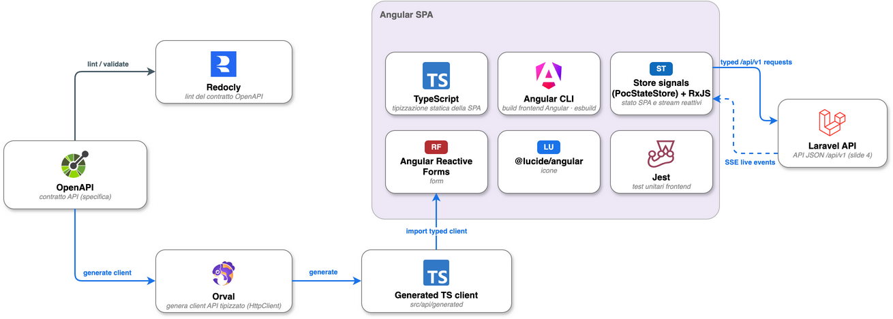

# ADR 0008 — Frontend Angular e serving statico LocalStack

Status: Accepted, implemented
Date: 2026-06-24

## Context

La PoC espone una SPA per operatori HR/CdL e mantiene Laravel come API JSON versionata. Il
Capitolato cita una dashboard Angular e un pattern di distribuzione statico su S3 + CloudFront.
La repository usa gia' Docker Compose, Terraform e LocalStack per modellare servizi AWS-like
locali.

## Decision

Il frontend attivo e' una SPA Angular/TypeScript in `apps/frontend`, buildata con Angular CLI e
servita in produzione locale da Nginx. Orval genera un servizio Angular basato su HttpClient dal
contratto OpenAPI, cosi' i componenti non istanziano HttpClient direttamente per le API di
dominio.

La navigazione usa Angular Router per le tre viste top-level (`overview`, `assistant`,
`copilot`) mantenendo lo stesso layout operativo e gli stessi anchor interni. Lo stato condiviso
vive in uno store Angular a signal; SSE, upload multipart, preview PDF, dark mode, error states e
loading states restano espliciti.

Terraform LocalStack provisiona anche un bucket S3 dedicato agli asset Angular. Il percorso
default locale passa da Traefik al servizio Docker `edge-cdn`: un **secondo Nginx**
che **emula in locale il ruolo di una CDN/edge** davanti al bucket S3 LocalStack — serve gli
asset statici e inoltra `/api/`, `/health` e `/ready` all'Nginx applicativo/Laravel. Non emula
Amazon CloudFront né la sua semantica; ne riproduce solo il *ruolo* di distribuzione edge. In
produzione quel ruolo sarebbe ricoperto da AWS CloudFront (vedi *Evoluzione*). Il deploy locale
carica `apps/frontend/dist` nel bucket con cache-control differenziato: `index.html` no-cache,
bundle hashati immutable, altri asset con cache breve.

Il serving CDN locale è un container Nginx **separato** dall'Nginx applicativo, per due motivi:
(1) **sostanziale** — l'Nginx applicativo è un'immagine di produzione (buildata, scansionata da
Trivy, pubblicata su GHCR) e non deve contenere riferimenti a LocalStack; isolare il serving da
S3 emulato in un container scaffolding solo-locale mantiene pulito l'artefatto di produzione;
(2) **di forma** — riflette la topologia reale CDN → origin, dove l'edge è distinto dall'origin
applicativo.

Sorgente editabile: [`03_frontend_spa_contratto_api.drawio`](../architecture/diagrams/03_frontend_spa_contratto_api.drawio), export [`SVG`](../architecture/diagrams/03_frontend_spa_contratto_api.drawio.svg).

## Consequences

- Il frontend applicativo resta su Angular, Angular Router, HttpClient, RxJS e signal store.
- La build statica Angular non dipende dal dev server.
- Traefik e `edge-cdn` (emulatore CDN locale, Nginx) sono il percorso integrato
  default per demo end-to-end.
- S3 LocalStack + emulatore CDN locale (Nginx) valida il pattern build → bucket → distribuzione
  edge, **non** la semantica di Amazon CloudFront (OAC, invalidation, signed URL, edge propagation).
- I documenti possono usare `POC_DOCUMENT_DISK=real_s3` e `AWS_REAL_*` per Textract reale senza
  toccare `FRONTEND_STATIC_BUCKET`, che resta dedicato alla SPA locale.

## Evoluzione

Il target di produzione è sostituire l'emulatore CDN locale con **Amazon CloudFront** davanti a
un bucket S3 **privato** con Origin Access Control (OAC), invalidation di `index.html` al deploy
e response headers policy gestite. L'Nginx `edge-cdn` resta solo lo stand-in locale
per le demo offline, dato che l'immagine LocalStack Community non espone l'API CloudFront.

## Alternatives considered

- **Servire la SPA da S3 con il solo Nginx applicativo** (un container): scartato perché
  imporrebbe un `proxy_pass` verso LocalStack dentro l'immagine di produzione, accoppiandola
  all'ambiente locale; il container CDN separato evita questo.
- **Servire la SPA dal filesystem dell'Nginx applicativo**: possibile (l'immagine include già la
  build), ma non eserciterebbe il percorso via object storage S3.
- **Usare l'API CloudFront di LocalStack via Terraform**: scartato perché l'immagine LocalStack
  Community risponde `501` per CloudFront; il ruolo edge resta emulato dal servizio Docker Nginx.
- **Client API scritto a mano**: scartato per evitare deriva dal contratto OpenAPI.

## Implementation evidence

- `apps/frontend/angular.json`, `src/app/`, `src/api/generated/`.
- `apps/frontend/orval.config.ts` con `client: "angular"`.
- `docker/nginx/Dockerfile` builda Angular con `node:22-bookworm-slim`.
- `infra/localstack/main.tf` risorsa `aws_s3_bucket.frontend_static`.
- `docker/edge-cdn/default.conf.template` e servizio Compose `edge-cdn`.
- `Makefile` target `frontend-s3-local-*`, `edge-cdn-local-url` e
  `frontend-serving-local-test`.

## Related documents

- [`0001-frontend-spa.md`](0001-frontend-spa.md)
- [`0002-laravel-api-json.md`](0002-laravel-api-json.md)
- [`0004-localstack-terraform.md`](0004-localstack-terraform.md)
