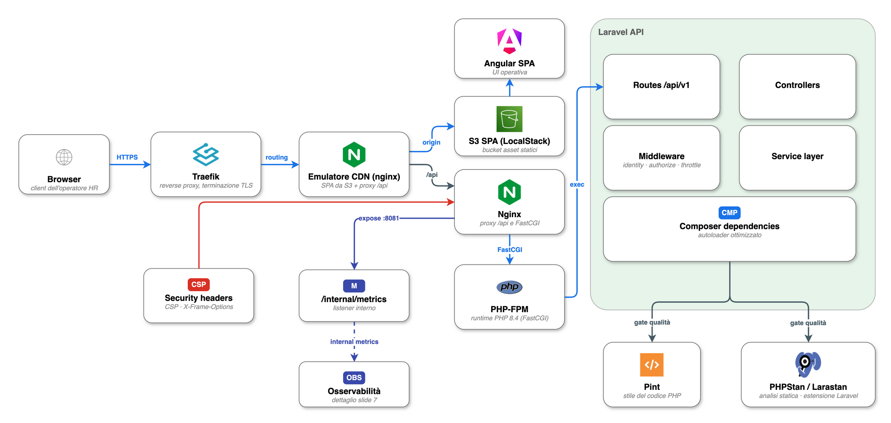

# Architettura della PoC

Questo documento descrive l'architettura runtime effettivamente implementata nella PoC: i
confini tra i componenti, cosa gira in locale tramite LocalStack e cosa può essere indirizzato
verso AWS reale, e i principi di qualità che trovano riscontro nel codice.

## Diagramma dell'architettura

Sorgente editabile: [`diagrams/final-architecture.drawio`](diagrams/final-architecture.drawio)
(draw.io / diagrams.net, loghi ufficiali incorporati); versione vettoriale in
[`final-architecture.drawio.svg`](diagrams/final-architecture.drawio.svg). Le aree colorate
distinguono i piani logici — Frontend, Client/Edge, Applicazione, Config, Dati, Infra locale,
Orchestrazione (LocalStack), AWS reale, Osservabilità e CI/Qualità — mentre lo stile delle
frecce distingue i flussi (vedi legenda nel diagramma): sincrono, workflow asincrono,
errore/DLQ, telemetria, provisioning/infra/CI, build frontend ed encryption. Il diagramma
include anche il legame di control-plane **IAM → Step Functions** (execution role,
least-privilege documentata — non applicata da LocalStack in locale) e il registry **GHCR**
nella pipeline CI (mirror delle immagini base e pubblicazione delle immagini buildate). Gli
export PNG/SVG vanno rigenerati da draw.io dopo ogni modifica (`drawio -x -f png -s 1.6 -b 24 ...`).

## Confine di runtime

| Livello | Componente implementato | Ruolo |
| --- | --- | --- |
| Frontend | SPA Angular/TypeScript in `apps/frontend` | Upload, stato di elaborazione, revisione, flussi di anteprima/eliminazione. |
| Edge | Traefik (TLS), emulatore CDN locale (Nginx) e Nginx applicativo | HTTPS locale, serving della SPA da S3 LocalStack, proxy API, blocco delle superfici `/admin`. |
| API | API JSON Laravel in `app/Http` | Validazione, controlli di tenant, audit event, avvio del workflow. |
| Workflow | Step Functions e SQS (LocalStack) | Orchestrazione production-like con callback task token, end-to-end. |
| Worker | `php artisan poc:workflow:consume` | Ricezione SQS, esecuzione dei task, `SendTaskSuccess`/`SendTaskFailure`, `SendTaskHeartbeat`. |
| OCR | `App\Copilot\Ocr\Services\TextractService` | Integrazione Textract reale, disabilitata di default nelle esecuzioni locali/CI standard. |
| AI | `App\Copilot\Ai\BedrockService` | Integrazione Bedrock reale per split/estrazione/generazione. |
| Storage | Dischi Laravel `s3` o `real_s3`, bucket `frontend_static` | S3 LocalStack per documenti locali e asset Angular, S3 reale opzionale solo per documenti/Textract. |
| Persistenza | PostgreSQL | Documenti, sotto-documenti, dati estratti, audit e stato dei task di workflow. |
| Cache/sessione | Redis | Cache/sessione e rate limiting; non è la fonte di verità dei dati. |
| Osservabilità | OTel Collector, Prometheus, Tempo, Grafana, Alertmanager | Metriche, trace, dashboard e alert locali. |
| Log | Grafana Alloy, Loki | Raccolta e archiviazione dei log dei container, interrogabili in Grafana. |

## LocalStack e AWS reale

LocalStack fornisce le primitive di orchestrazione production-like testabili in locale:
Step Functions, SQS/DLQ, S3, EventBridge, SSM Parameter Store e Secrets Manager. L'applicazione
parla con i servizi AWS, reali o emulati, **senza cambiare codice**: cambiano solo endpoint e
credenziali.

La SPA Angular usa come default locale il percorso `Traefik -> frontend-cloudfront -> S3
LocalStack`: `make frontend-s3-local-deploy` carica `apps/frontend/dist` nel bucket
`FRONTEND_STATIC_BUCKET`, poi `https://localhost:8443` serve gli asset da quel bucket. Il
servizio `frontend-cloudfront` è un **secondo Nginx** che emula in locale il **ruolo di una
CDN/edge** (non Amazon CloudFront): serve gli asset statici e inoltra `/api/`, `/health` e
`/ready` all'Nginx applicativo/Laravel. È un container separato dall'Nginx applicativo di
proposito — quest'ultimo è un'immagine di produzione (buildata, scansionata, pubblicata) e non
deve conoscere LocalStack, mentre il serving da S3 emulato resta confinato in uno scaffolding
solo-locale; la separazione riflette anche la topologia reale CDN → origin. L'Nginx applicativo
resta il proxy verso PHP-FPM e il percorso interno di compatibilità (include la build SPA), ma
non è l'origine primaria della SPA nel flusso default. L'emulazione non sostituisce una CDN
reale: in produzione il ruolo sarebbe ricoperto da AWS CloudFront (bucket privato + OAC,
invalidation, edge propagation).

### Dettaglio edge/runtime/API

Sorgente editabile: [`04_edge_runtime_backend_api.drawio`](diagrams/04_edge_runtime_backend_api.drawio), export [`SVG`](diagrams/04_edge_runtime_backend_api.drawio.svg).

Alcune primitive sono provisionate ma **non esercitate** dall'applicativo: il bus EventBridge
(con rule e target verso SQS) e l'identità SES esistono in Terraform, ma nessun codice pubblica
eventi o invia email. Le policy IAM (es. execution role di Step Functions) sono definite come
least-privilege *documentata* ma **non applicate da LocalStack** in locale: diventano effettive
solo sul percorso AWS reale.

AWS reale viene usato solo per il percorso critico di validazione AI/OCR, quando sono fornite
credenziali e configurazione esplicite:

- `POC_DOCUMENT_DISK=real_s3`
- `AWS_REAL_REGION`
- `AWS_REAL_ACCESS_KEY_ID`
- `AWS_REAL_SECRET_ACCESS_KEY`
- `AWS_REAL_SESSION_TOKEN`, quando necessario
- `AWS_REAL_S3_BUCKET`
- `AWS_REAL_S3_PREFIX`
- `BEDROCK_REGION`
- `BEDROCK_MODEL_ID`
- `TEXTRACT_ENABLED=true`

Le variabili `FRONTEND_STATIC_BUCKET` e `FRONTEND_CLOUDFRONT_LOCAL_URL` sono locali e dedicate
alla SPA: non devono puntare a bucket reali e non governano il caricamento documenti.

I test e la CI standard non chiamano S3, Textract o Bedrock reali.

## Principi di qualità implementati

| Principio di riferimento | Implementazione concreta |
| --- | --- |
| AWS Well-Architected — operational excellence | Avvio ripetibile via Docker/Terraform, endpoint `/health` e `/ready`, target `make verify*`. |
| AWS Well-Architected — reliability | Retry/catch espliciti in Step Functions, heartbeat per task, DLQ SQS, tabella di workflow idempotente. |
| AWS Well-Architected — security | Nessuna UI di amministrazione runtime, nessun segreto reale committato, header di sicurezza e CSP in nginx, matrice IAM a privilegio minimo documentata. |
| Baseline OWASP ASVS/API | Validazione upload server-side, controlli di ownership per tenant, rate limit, confine di autenticazione strutturato. |
| Google SRE — monitoring | Metriche API golden-signal, metriche della pipeline documentale, alert coda/DLQ con runbook. |
| Modello OpenTelemetry | Il Collector riceve OTLP ed esporta metriche verso Prometheus e trace verso Tempo. |
| Logging centralizzato | Grafana Alloy invia i log di ogni container a Loki, correlati in Grafana con metriche e trace. |

## Riferimenti principali

- AWS Well-Architected Framework: https://docs.aws.amazon.com/wellarchitected/latest/framework/welcome.html
- OWASP ASVS: https://owasp.org/www-project-application-security-verification-standard/
- Google SRE — Monitoring Distributed Systems: https://sre.google/sre-book/monitoring-distributed-systems/
- OpenTelemetry Collector: https://opentelemetry.io/docs/collector/
- Prometheus alerting: https://prometheus.io/docs/alerting/latest/overview/
- Grafana provisioning: https://grafana.com/docs/grafana/latest/administration/provisioning/
