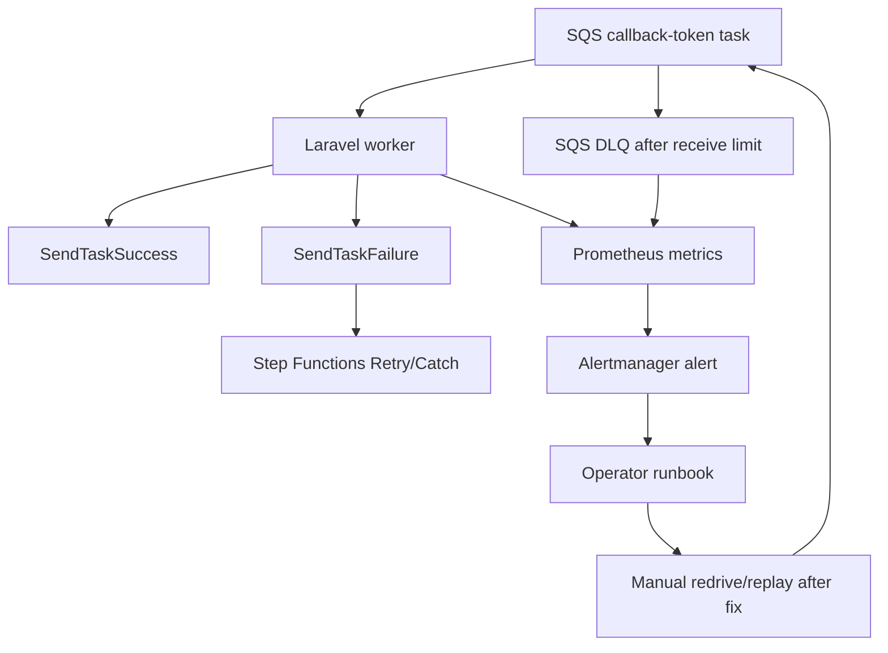

# DLQ and Recovery Runbook

## Implemented Path

Step Functions sends callback-token work to SQS. The documents queue has:

- `visibility_timeout_seconds = 330`
- `maxReceiveCount = 3`
- redrive to `mvp-documents-dlq`

The worker records every task in `document_workflow_tasks` by `task_token_hash`. Successful or skipped tasks are idempotent and are not reprocessed when the same token is seen again.



## Inspect DLQ

```bash
docker compose exec app php artisan mvp:dlq:list
```

The command reads up to 10 messages from the DLQ with `VisibilityTimeout=0`, prints a preview, and records `mvp_dlq_messages_total`.

## Recovery Procedure

1. Open Grafana `Queues and DLQ`.
2. Run `mvp:dlq:list` and capture message id/body preview.
3. Check `document_workflow_tasks` for the task status and error message.
4. Check `original_documents.workflow_failure_reason`.
5. Fix the root cause: missing IAM, bad S3 key, model access, or invalid payload.
6. Re-drive from DLQ to source queue using the cloud console/CLI for the target environment.
7. Confirm idempotency by checking that duplicated succeeded tasks are skipped.

The MVP implements diagnostic DLQ inspection and idempotent task records. Automated replay is intentionally not implemented because the final replay mechanism depends on enterprise operational controls and IAM boundaries.

## Relevant Metrics

| Metric | Meaning |
| --- | --- |
| `mvp_sqs_messages_received_total` | Worker received task messages. |
| `mvp_sqs_messages_failed_total` | Worker task failures. |
| `mvp_dlq_messages_total` | Messages seen during DLQ inspection. |
| `mvp_document_stuck_processing_total` | Documents beyond processing timeout. |
| `mvp_stepfunctions_executions_started_total` | Workflow starts. |
| `mvp_stepfunctions_executions_failed_total` | Workflow start/task failures. |
