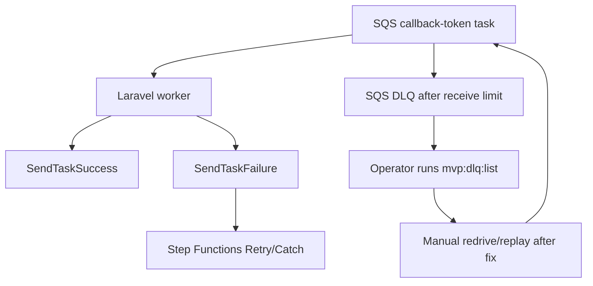

# DLQ and Recovery Runbook

## Implemented Path

Step Functions sends callback-token work to SQS. Each pipeline owns its queue, so a backlog in one domain cannot delay the other. Both queues have:

- `visibility_timeout_seconds = 900`
- `message_retention_seconds = 345600`
- `maxReceiveCount = 3`

| Pipeline | Queue | DLQ | Inspect with |
| --- | --- | --- | --- |
| Documents | `mvp-documents` | `mvp-documents-dlq` | `mvp:dlq:list --queue=documents` |
| Communications | `mvp-communications` | `mvp-communications-dlq` | `mvp:dlq:list --queue=communications` |

The workers record every task in `workflow_tasks` by `task_token_hash`, whatever the domain. Successful or skipped tasks are idempotent and are not reprocessed when the same token is seen again.

`ConsumeWorkflowTasks::sendCallback()` classifies a rejected `SendTaskSuccess`/`SendTaskFailure` before deciding whether to delete the SQS message: on a **transient** AWS error (throttling, service unavailable, ...) the message stays queued for a normal SQS redelivery/retry. On a **permanent** error (`TaskTimedOut`, `TaskDoesNotExist`, `InvalidToken` — a retry with the same token can never succeed) the message is deleted immediately even though the callback was rejected, because the business outcome is already tracked in `workflow_tasks`/the domain record; leaving it queued would only produce `maxReceiveCount` retries that populate the DLQ with false failures for work that already finished. A message that does reach the DLQ today is therefore always a transient-error case repeated 3 times, not a permanent one.


```mermaid
flowchart TD
  task["SQS callback-token task"]
  worker["Laravel worker"]
  success["SendTaskSuccess"]
  failure["SendTaskFailure"]
  retry["Step Functions Retry/Catch"]
  dlq["SQS DLQ after receive limit"]
  operator["Operator runs mvp:dlq:list"]
  replay["Manual redrive/replay after fix"]

  task --> worker
  worker --> success
  worker --> failure
  failure --> retry
  task --> dlq
  dlq --> operator
  operator --> replay
  replay --> task
```

## Inspect DLQ

```bash
docker compose exec app php artisan mvp:dlq:list --queue=documents
```

The command reads up to 10 messages from the DLQ with `VisibilityTimeout=0` and prints a preview. There is no automated depth monitoring (the previous Prometheus-based probe was removed, see [ADR 0014](../architecture-decisions/0014-rimozione-stack-osservabilita.md)): run this command periodically or after a suspected failure to check whether a DLQ has accumulated messages.

## Recovery Procedure

1. Run `mvp:dlq:list --queue=<pipeline>` and capture message id/body preview.
2. Check `workflow_tasks` for the task status and error message (`subject_type` tells the domain).
3. Check `original_documents.workflow_failure_reason` or `communications.workflow_failure_reason`.
4. Fix the root cause: missing IAM, bad S3 key, model access, or invalid payload.
5. Re-drive from DLQ to source queue using the cloud console/CLI for the target environment.
6. Confirm idempotency by checking that duplicated succeeded tasks are skipped.

The MVP implements diagnostic DLQ inspection and idempotent task records. Automated replay is intentionally not implemented because the final replay mechanism depends on enterprise operational controls and IAM boundaries.
