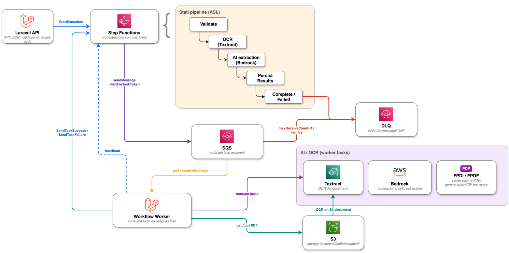

# Document Pipeline Runbook

## Normal Flow



<sub>Sorgente editabile: [`06_workflow_async_ai_ocr.drawio`](../architecture/diagrams/06_workflow_async_ai_ocr.drawio), export [`SVG`](../architecture/diagrams/06_workflow_async_ai_ocr.drawio.svg).</sub>

1. SPA posts a PDF to `POST /api/v1/documents/ocr`.
2. `UploadDocumentRequest` validates MIME type, size, filename, PDF readability, page count and optional Textract limits.
3. `DocumentProcessingService::storeUpload()` stores the original file on the configured document disk.
4. `DocumentWorkflowService::start()` starts the Step Functions execution and stores execution metadata on `original_documents`.
5. Step Functions sends callback-token tasks to SQS.
6. `php artisan poc:workflow:consume` receives each message, executes the task through `DocumentWorkflowTaskHandler`, and calls `SendTaskSuccess` or `SendTaskFailure`.
7. `textract.ocr` calls real Textract only when `TEXTRACT_ENABLED=true` and stores the page-aware OCR text (`ocr_text` + `ocr_pages`) consumed by the next step.
8. `bedrock.extract` classifies the document and splits it by recipient, then extracts fields, both from the OCR text via Bedrock (text-only Converse, no PDF document block); it persists `sub_documents` and `extracted_data`. The confidence score is computed from OCR legibility × key-field completeness, not from the model's self-assessment.
9. `persist.results` returns the current processing state.
10. `dispatch.domain_event` marks workflow completion metadata and records metrics.

## Required Runtime Configuration

| Variable | Required for | Notes |
| --- | --- | --- |
| `DOCUMENT_PIPELINE_STATE_MACHINE_ARN` | API workflow start | Created by LocalStack Terraform in local runs. |
| `DOCUMENT_PIPELINE_TASK_QUEUE_URL` | API and worker | SQS callback-token queue URL. |
| `SQS_DLQ_URL` | DLQ diagnostics | Used by `poc:dlq:list`. |
| `POC_DOCUMENT_DISK` | Upload storage | Use `s3` for LocalStack demo, `real_s3` for real Textract validation. |
| `AWS_REAL_*` | Real S3/Textract | Must not be committed. |
| `TEXTRACT_ENABLED` | OCR | Defaults false in local/CI. Requires `POC_DOCUMENT_DISK=real_s3`. |
| `BEDROCK_MODEL_ID` | AI extraction | Real Bedrock access must be granted externally. |

When `TEXTRACT_ENABLED=true`, `POC_DOCUMENT_DISK` must be `real_s3`: real Textract can only read objects from real S3, so `DocumentWorkflowService::start()` rejects the workflow up front with an explicit error if OCR is enabled while documents live on the LocalStack disk. The S3 key passed to Textract includes the document disk root prefix (`AWS_REAL_S3_PREFIX`).

## Manual Smoke

```bash
make setup
curl --insecure https://localhost:8443/health
curl --insecure https://localhost:8443/ready
```

Upload a small PDF from the SPA, then watch:

```bash
make logs
docker compose exec app php artisan poc:dlq:list
```

Worker logs are also available in Grafana (Loki): see the `document-pipeline` and `ai-ocr-quality` dashboards or query `{project="poc", service="queue"}` in the `Logs and Errors` dashboard.

## Scaling Workers

```bash
make workers WORKERS=2   # docker compose up -d --scale queue=2
```

Multiple workers are safe: each Step Functions callback token is tracked in `document_workflow_tasks` (`task_token_hash` unique) and claimed atomically, so a duplicate SQS delivery is consumed without re-running the business logic (`poc_sqs_messages_duplicate_total` counts these). The SQS `visibility_timeout_seconds` (900s, Terraform) exceeds the longest ASL task timeout (720s), so an in-flight message never becomes visible to a second worker while still being processed. Workers send `SendTaskHeartbeat` while polling Textract and between Bedrock segments; a stale `running` task (dead worker) is re-claimable after `POC_WORKFLOW_CLAIM_TTL_SECONDS` (default 900s).

Real AWS OCR smoke is intentionally separate:

```bash
POC_DOCUMENT_DISK=real_s3 TEXTRACT_ENABLED=true make aws-smoke
```

`make aws-smoke` currently validates required configuration only. Add account-specific S3/Textract/Bedrock calls after enterprise IAM roles and model access are supplied.

## Failure States

| Failure | Observable signal | Operator action |
| --- | --- | --- |
| Workflow start failure | `workflow_failed_at`, audit event, `poc_stepfunctions_executions_failed_total` | Check state machine ARN and SQS queue URL. |
| SQS task failure | `document_workflow_tasks.status=failed`, worker log | Inspect DLQ and task error. |
| Textract failure | `poc_textract_jobs_failed_total` | Check real S3 object key, IAM and Textract limits. |
| Bedrock failure | failed document/sub-document error message | Check model access, model ID and credentials. |
| Stuck document | `poc_document_stuck_processing_total` | Check worker, SQS queue and Step Functions execution. |
