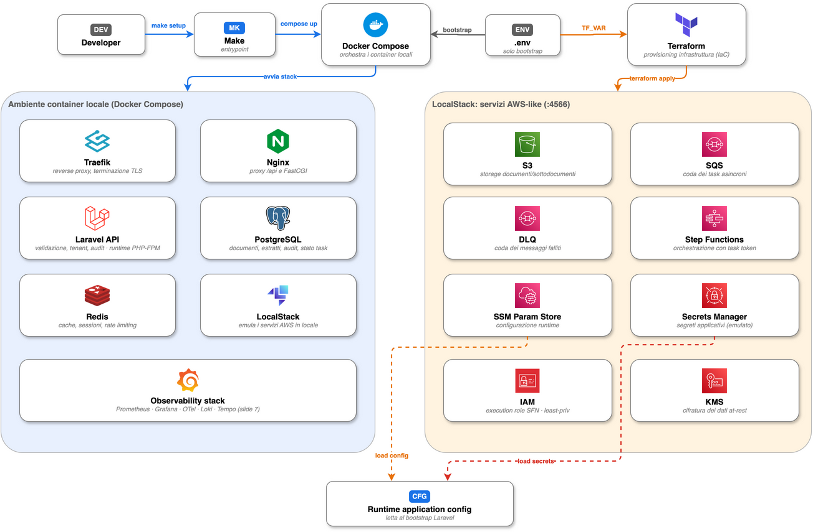

# Local Production-Like Runbook

## Start

```bash
make setup
```

Il target esegue:

- generazione TLS locale tramite container se cert/key non esistono gia';
- build delle immagini applicative;
- avvio di PostgreSQL, Redis e LocalStack;
- `terraform init` e `terraform apply` dal container Compose `terraform`;
- migrazioni applicative;
- avvio di app, Nginx, worker SQS, Traefik, OTel Collector, Prometheus, Tempo, Alertmanager, Grafana, Loki e Grafana Alloy.



<sub>Sorgente editabile: [`02_ambiente_locale_provisioning.drawio`](../architecture/diagrams/02_ambiente_locale_provisioning.drawio), export [`SVG`](../architecture/diagrams/02_ambiente_locale_provisioning.drawio.svg).</sub>

Endpoint:

- App: https://localhost:8443
- Health: https://localhost:8443/health
- Readiness: https://localhost:8443/ready
- Grafana: https://grafana.localhost:8443 (login Grafana)
- Prometheus: https://prometheus.localhost:8443 (basic auth `mvp` / `mvp-obs-local-password`)
- Alertmanager: https://alertmanager.localhost:8443 (basic auth)
- Tempo: https://tempo.localhost:8443 (basic auth)
- LocalStack edge: http://localhost:4566 (bind solo 127.0.0.1)

Le dashboard non espongono porte sull'host: si passa sempre da Traefik
(`*.localhost` è risolto dai browser; da CLI usare `curl --resolve`).

## TLS locale trusted

`make local-tls` resta completamente containerizzato e genera un certificato
self-signed per Traefik. E' sufficiente per smoke test e CLI, ma i browser
mostrano l'avviso di identita' non riconosciuta.

Per sopprimere l'avviso in modo pulito, usare una CA locale trusted con
`mkcert` installato sull'host:

```bash
make trusted-local-tls
docker compose restart traefik
```

Il target esegue `mkcert -install`, crea un certificato valido per
`localhost`, `mvp.localhost`, `*.localhost`, `127.0.0.1` e `::1`, e lo scrive
negli stessi file montati da Traefik. Non viene eseguito dentro Docker perche'
deve aggiornare il trust store della macchina locale.

## Terraform

Terraform vive in `infra/localstack` ma viene eseguito solo tramite Docker Compose:

```bash
make infra-up
make infra-init
make infra-plan
make infra-apply
make infra-destroy
```

Il servizio `terraform` usa l'endpoint interno `http://localstack:4566` e crea S3, SQS/DLQ, Step Functions, EventBridge, SES, SSM Parameter Store e Secrets Manager.

## Runtime Configuration

I container applicativi ricevono solo parametri bootstrap `CONFIG_*`. I valori runtime sono caricati da:

- SSM Parameter Store: `/mvp/app`
- Secrets Manager: `/mvp/app/runtime`

Se una chiave obbligatoria manca, il bootstrap Laravel fallisce. Questa scelta evita configurazioni implicite e rende visibili errori di provisioning.

I valori risolti vengono cachati in `bootstrap/cache/runtime-config.php` dentro il container (PHP-FPM rieseguirebbe altrimenti le chiamate SSM/Secrets a ogni richiesta). La cache vive quanto il container: `make refresh-runtime` ricrea `app` e `queue` e quindi la rigenera.

## Observability

```bash
make observability-config
make observability-up
```

Il Collector scrapea:

- metriche applicative interne da `nginx:8081/internal/metrics` (listener non instradato da Traefik);
- metriche Traefik da `traefik:9100/metrics`;
- metriche del Collector da `otel-collector:8888`.

Prometheus legge l'exporter del Collector su `otel-collector:9464`, invia alert ad Alertmanager e Grafana carica datasource/dashboard da file.

Grafana Alloy raccoglie i log di tutti i container del progetto tramite il socket Docker e li invia a Loki; Grafana li interroga con il datasource Loki (dashboard `Logs and Errors` e pannelli log delle altre dashboard). Le metriche di dominio del worker raggiungono `/internal/metrics` grazie al volume `observability-metrics` condiviso tra `app` e `queue`.

## Reset Completo

```bash
make reset-all          # chiede conferma
make reset-all FORCE=1  # senza conferma
```

Elimina tutti i volumi locali (PostgreSQL, Redis, LocalStack, osservabilita'), svuota il prefisso del bucket S3 reale se `AWS_REAL_S3_BUCKET` e' configurato nel `.env`, e riesegue `make setup` da zero. E' distruttivo per design: pensato per riportare la MVP allo stato iniziale.

## Checks

```bash
make test
make pint
make frontend-typecheck
make frontend-test
make frontend-build
make frontend-audit
make frontend-a11y
make verify-fast
make verify
```

La suite imposta `CONFIG_SOURCE=env` per restare indipendente da LocalStack. I test di pipeline usano mock mirati dei servizi AI e non modificano il contratto runtime.

## Real AWS OCR/AI

La configurazione locale standard usa LocalStack S3 e `TEXTRACT_ENABLED=false`. Per validare il percorso critico con S3/Textract reali, impostare esplicitamente:

```bash
MVP_DOCUMENT_DISK=real_s3
AWS_REAL_REGION=...
AWS_REAL_S3_BUCKET=...
AWS_REAL_S3_PREFIX=documents/
TEXTRACT_ENABLED=true
TEXTRACT_REGION=...   # stessa regione del bucket S3
```

Dopo ogni modifica al `.env`, applicare i nuovi valori a SSM/Secrets e ricaricare i processi:

```bash
make refresh-runtime
```

Le credenziali `AWS_REAL_*` sono condivise da S3, Textract e Bedrock e non vanno salvate in repository. Bedrock richiede `BEDROCK_REGION` e `BEDROCK_MODEL_ID` con accesso gia' abilitato nell'account. Per le cover immagini dell'Assistant usa `BEDROCK_IMAGE_MODEL_ID=amazon.nova-canvas-v1:0` quando il modello e' disponibile nella tua region.
