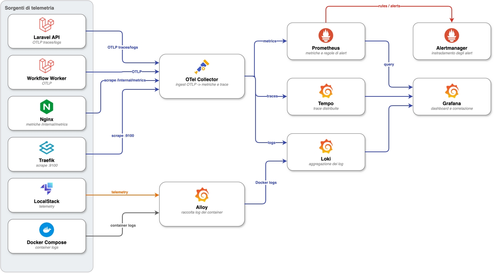

# Observability Runbook

## Local Services

| Service | URL | Purpose |
| --- | --- | --- |
| Prometheus | https://prometheus.localhost:8443 (basic auth) | Metrics store and alert rule evaluation. |
| Alertmanager | https://alertmanager.localhost:8443 (basic auth) | Local/demo alert routing. |
| Grafana | https://grafana.localhost:8443 (Grafana login) | Provisioned dashboards, logs and traces. |
| Tempo | https://tempo.localhost:8443 (basic auth) | Trace storage queried by Grafana. |
| OTel Collector | internal `otel-collector:4317/4318` | OTLP ingest and Prometheus scraping. |
| Loki | internal `loki:3100` | Log storage queried by Grafana. |
| Grafana Alloy | internal `alloy:12345` | Collects container logs and ships them to Loki. |

No host ports: the UIs are reachable only through Traefik on the internal
`observability` network. Default basic auth credentials live in
`docker/traefik/usersfile` (`poc` / `poc-obs-local-password`, local only).
Browsers resolve `*.localhost` natively; for `curl` add
`--resolve prometheus.localhost:8443:127.0.0.1` (or `/etc/hosts` entries).



<sub>Sorgente editabile: [`07_osservabilita.drawio`](../architecture/diagrams/07_osservabilita.drawio), export [`SVG`](../architecture/diagrams/07_osservabilita.drawio.svg).</sub>

## Start and Validate

```bash
make observability-config
make observability-up
```

`make observability-config` validates:

- OTel Collector configuration;
- Prometheus configuration and rule files.

## Metrics and Traces Flow

1. Laravel exposes `/internal/metrics` through a dedicated Nginx listener on `:8081`, not through the Traefik-facing listener on `:8080`.
2. The `app` and `queue` containers share the `observability-metrics` volume, so domain metrics recorded by the worker (Textract, SQS, workflow completion) are exposed by the same `/internal/metrics` endpoint.
3. OTel Collector scrapes Nginx, Traefik and itself.
4. OTel Collector exports metrics on `:9464`.
5. Prometheus scrapes the Collector exporter and evaluates alert rules.
6. Alertmanager receives alerts from Prometheus.
7. Tempo receives traces from the OTel Collector.
8. Grafana provisions Prometheus, Tempo and Loki datasources from file.

## Logs Flow

1. Grafana Alloy discovers the project's containers through the Docker socket (`com.docker.compose.project=poc`).
2. Alloy reads each container's log stream and ships it to Loki, labelling lines with `service`, `container` and `project`.
3. Application logs sent over OTLP reach the OTel Collector, which forwards them to Loki's native OTLP ingestion endpoint (`loki:3100/otlp`).
4. Loki stores logs on a local filesystem volume with a 7-day retention.
5. Grafana queries Loki for the logs panels and the `Logs and Errors` dashboard.

Useful LogQL queries:

```logql
{project="poc", service="queue"}
{project="poc", service=~"queue|app"} |~ "(?i)level_name.{0,6}(error|critical|emergency)"
{project="poc"} |~ "(?i)(level_name.{0,6}(error|critical|emergency)|level=(error|critical|fatal))" != "No such container"
```

Monolog application logs are JSON with `level_name`; infrastructure containers use logfmt with `level=`. The error filters above match both. The `!= "No such container"` clause drops Alloy's transient errors emitted while containers are being recreated.

## Dashboards

Dashboard JSON lives in `docker/grafana/dashboards`:

- `api-golden-signals.json` — request rate, error rate, p95/p99 latency, a per-endpoint golden-signals table and a saturation row (edge open connections, pipeline backlog, collector memory) covering all four golden signals.
- `document-pipeline.json` — document status, pipeline steps (SQS), Step Functions failures and a pipeline error log panel.
- `queues-and-dlq.json` — SQS throughput, DLQ, dependency readiness and worker logs.
- `ai-ocr-quality.json` — Textract confidence/duration, failures by error code, communications by status and OCR error logs.
- `logs-and-errors.json` — error counts and rates per service plus raw log panels per service.

Datasource provisioning (Prometheus, Tempo, Loki) lives in `docker/grafana/provisioning`.

## Alert Rules

Rules live in `docker/prometheus/rules`:

- `api-alerts.yml`
- `pipeline-alerts.yml`
- `queue-alerts.yml`
- `ai-alerts.yml`

Every alert carries a `runbook` annotation linking to the relevant runbook in `docs/runbooks/`. `DLQNotEmpty` is `critical` (terminal failure path); the remaining alerts are `warning` except `TargetDown` (`critical`).

The local Alertmanager receiver is intentionally a demo receiver. Do not configure real email, Slack or paging secrets in this repository.
