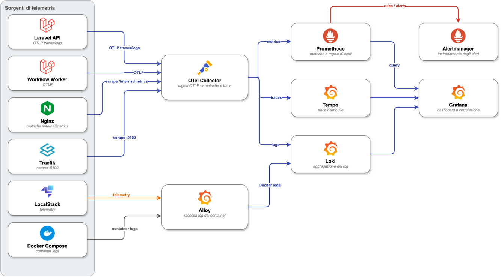

# Observability Runbook

## Local Services

| Service | URL | Purpose |
| --- | --- | --- |
| Prometheus | https://prometheus.localhost:8443 (basic auth) | Metrics store and alert rule evaluation. |
| Alertmanager | https://alertmanager.localhost:8443 (basic auth) | Local/demo alert routing. |
| Grafana | https://grafana.localhost:8443 (Grafana login) | Provisioned dashboards, logs and traces. |
| Tempo | https://tempo.localhost:8443 (basic auth) | Trace storage queried by Grafana. |
| OTel Collector | internal `otel-collector:4317/4318` | OTLP ingest and Prometheus scraping. |
| Loki | internal `loki:3100` | Log storage queried by Grafana. |
| Grafana Alloy | internal `alloy:12345` | Collects container logs and ships them to Loki. |

No host ports: the UIs are reachable only through Traefik on the internal
`observability` network. Default basic auth credentials live in
`docker/traefik/usersfile` (`mvp` / `mvp-obs-local-password`, local only).
Browsers resolve `*.localhost` natively; for `curl` add
`--resolve prometheus.localhost:8443:127.0.0.1` (or `/etc/hosts` entries).



<sub>Sorgente editabile: [`07_osservabilita.drawio`](../architecture/diagrams/07_osservabilita.drawio), export [`SVG`](../architecture/diagrams/07_osservabilita.drawio.svg).</sub>

## Start and Validate

```bash
make observability-config
make observability-up
```

`make observability-config` validates:

- OTel Collector configuration;
- Prometheus configuration and rule files.

## Metrics and Traces Flow

1. Laravel exposes `/internal/metrics` through a dedicated Nginx listener on `:8081`, not through the Traefik-facing listener on `:8080`.
2. The `app`, `queue` and `queue-communications` containers share the `observability-metrics` volume, so domain metrics recorded by the worker (Textract, SQS, workflow completion) are exposed by the same `/internal/metrics` endpoint.
3. OTel Collector scrapes Nginx, Traefik and itself.
4. OTel Collector exports metrics on `:9464`.
5. Prometheus scrapes the Collector exporter and evaluates alert rules.
6. Alertmanager receives alerts from Prometheus.
7. Tempo receives traces from the OTel Collector.
8. Grafana provisions Prometheus, Tempo and Loki datasources from file.

## Logs Flow

1. Grafana Alloy discovers the project's containers through the Docker socket (`com.docker.compose.project=mvp`).
2. Alloy reads each container's log stream and ships it to Loki, labelling lines with `service`, `container` and `project`.
3. Application logs sent over OTLP reach the OTel Collector, which forwards them to Loki's native OTLP ingestion endpoint (`loki:3100/otlp`).
4. Loki stores logs on a local filesystem volume with a 7-day retention.
5. Grafana queries Loki for the logs panels and the `Logs and Errors` dashboard.

Useful LogQL queries:

```logql
{project="mvp", service="queue"}
{project="mvp", service=~"queue|queue-communications|app"} |~ "(?i)level_name.{0,6}(error|critical|emergency)"
{project="mvp"} |~ "(?i)(level_name.{0,6}(error|critical|emergency)|level=(error|critical|fatal))" != "No such container"
```

Monolog application logs are JSON with `level_name`; infrastructure containers use logfmt with `level=`. The error filters above match both. The `!= "No such container"` clause drops Alloy's transient errors emitted while containers are being recreated.

## Metric contract

Le metriche di dominio sono **dichiarate** in `app/Mvp/Observability/DomainMetricCatalog.php`, non
dedotte da ciò che il file di accumulo contiene. Il catalogo definisce nome, tipo, help, label e —
dove i valori sono un insieme chiuso — i valori ammessi, presi dagli enum di dominio.

Tre conseguenze operative:

- una metrica dichiarata compare nell'esposizione **anche a zero**, prima di essere emessa la prima
  volta. I pannelli mostrano `0` invece di "No data" e le regole con `== 0` hanno una serie su cui
  valutare (è la ragione per cui `QueueBacklogHigh` prima non poteva scattare);
- una metrica ritirata dal codice smette davvero di essere esposta, anche se la sua chiave resta nel
  volume condiviso `observability-metrics`;
- `MetricsRecorder` rifiuta in `local`/`testing` una metrica non a catalogo o con label diverse da
  quelle dichiarate; in esercizio degrada a warning e registra comunque, perché un problema di
  strumentazione non deve abbattere il percorso di business.

`tests/Feature/ObservabilityContractTest.php` confronta il catalogo con il PromQL di **tutte** le
dashboard e le rule: nome inesistente, label non dichiarata, valore fuori enum e metrica che nessuno
guarda fanno fallire la suite. È l'unico controllo che copre il PromQL dentro i JSON delle
dashboard — `promtool check config` valida solo la sintassi delle regole.

### Convenzioni di naming, e perché contano qui

I counter terminano in `_total`; i gauge no. Non è formalismo: il `prometheusexporter` del Collector
appende `_total` ai sum monotoni che non ce l'hanno, quindi un counter chiamato `..._sum` esce come
`..._sum_total` e ogni query sul nome originale smette di trovarlo. È esattamente ciò che ha reso
vuoti i pannelli di confidenza e durata OCR pur essendoci il dato. Due difese:

- `add_metric_suffixes: false` in `docker/otel-collector/config.yml` — il Collector qui è un gateway
  di trasporto, non un normalizzatore di nomi;
- le due misure OCR sono dichiarate come famiglie `summary` (`mvp_textract_confidence`,
  `mvp_textract_duration_seconds`), così `_sum` e `_count` appartengono formalmente alla stessa
  metrica e restano corretti anche se qualcuno riabilitasse i suffissi.

### Profondità delle DLQ

`mvp_dlq_messages{queue}` è letta da SQS (`ApproximateNumberOfMessages`) a ogni scrape da
`DlqDepthProbe`, con timeout di 2-3 secondi. Se la lettura fallisce **non viene emessa alcuna serie
di profondità** e `mvp_dlq_probe_up{queue}` vale 0: uno zero inventato spegnerebbe in silenzio
`DLQNotEmpty`, che è severity critical. L'alert `DlqProbeDown` copre proprio questo caso.
Disattivabile con `MVP_DLQ_PROBE_ENABLED=false` dove SQS non è raggiungibile.

### Saturazione del trasporto

`mvp_workflow_tasks{status}` conta i task di workflow per stato di claim
(`pending`, `running`, `succeeded`, `skipped`, `failed`), con una sola query aggregata per scrape.
Serve a rispondere a una domanda che la profondità DLQ non copre: quella conta ciò che ha **smesso**
di essere ritentato, questa ciò che **attende** o è in corso.

Due letture utili in incidente:

- `pending` che cresce senza scendere → i worker non stanno consumando (controllare `queue` e
  `queue-communications`, e l'alert `QueueBacklogHigh`);
- `running` che non torna a zero → worker terminati senza rilasciare il claim. Il runner li recupera
  da solo dopo `MVP_WORKFLOW_RUNNING_CLAIM_TTL_SECONDS`, quindi il valore va letto su una finestra
  più lunga di quel TTL prima di concludere che c'è un problema.

### Label attese in Prometheus

Le metriche applicative arrivano a Prometheus attraverso il Collector, quindi portano
`job="mvp-otel-collector-exporter"` e `instance="otel-collector:9464"`; il job e l'istanza originali
sopravvivono come `exported_job` / `exported_instance`. Analogamente `mvp_app_info` espone
`exported_service_name` accanto a `service_name`, perché le label statiche del job `mvp-app` nel
Collector hanno lo stesso nome di quelle emesse dall'applicazione. È il comportamento atteso di
`honor_labels: false` e va lasciato così: attivare `honor_labels` farebbe collidere i target del
Collector con quelli di Prometheus e romperebbe `TargetDown` (`up == 0`).

### Diagnosi rapida

```bash
docker compose exec -T app curl -s http://nginx:8081/internal/metrics | grep -E '^# TYPE'
```

```bash
docker compose exec -T app curl -s http://otel-collector:9464/metrics | grep -E '^# TYPE mvp_'
```

Confrontare i due elenchi: i nomi devono coincidere. Una differenza significa che il Collector sta
riscrivendo i nomi e che le dashboard interrogano metriche che non esistono più.

```bash
curl -sk -u mvp:mvp-obs-local-password --resolve prometheus.localhost:8443:127.0.0.1 "https://prometheus.localhost:8443/api/v1/label/__name__/values"
```

Se un collector di gauge fallisce (per esempio una colonna mancante dopo una migrazione a metà),
la sua famiglia sparisce ma il resto dell'esposizione continua a essere servito, e
`mvp_metrics_collection_failures_total{collector}` dice quale ha ceduto.

## Dashboards

Dashboard JSON lives in `docker/grafana/dashboards`:

Ogni dashboard apre con un pannello di testo che dichiara la domanda a cui risponde e gli alert
correlati, e ogni pannello porta una `description` visibile sull'icona informativa: sono le due
raccomandazioni con cui si apre la guida Grafana, ed è anche il criterio per decidere se un pannello
nuovo appartiene o no a quella pagina.

- `api-golden-signals.json` — *triage in testa*. Prima fascia: stato del servizio, alert in firing,
  errori nell'ultima ora, per capire in due secondi se c'è un problema **adesso**. Seconda: i quattro
  segnali d'oro con i rispettivi andamenti. Terza: tabella per route e saturazione (connessioni edge,
  backlog pipeline, memoria del Collector).
- `document-pipeline.json` — *imbuto*. Il pannello portante mostra la dispersione fra i passi
  (rilevati → con esito → validati → scaricati): dice **dove** la pipeline perde documenti, che prima
  andava ricostruito confrontando due tabelle. Seguono stato corrente, throughput per task e cause
  dei fallimenti.
- `communication-pipeline.json` — *stessa struttura della pipeline documenti*, deliberatamente: due
  pipeline con la stessa forma si leggono con la stessa abitudine. L'imbuto va da richieste ad
  approvate; il passo della copertina può restare indietro senza che sia un guasto.
- `queues-and-dlq.json` — *metodo USE*, che descrive lo stato di una risorsa: **Utilization** (lavoro
  che scorre), **Saturation** (DLQ, task in attesa, bloccati oltre timeout), **Errors** (messaggi
  falliti, heartbeat, callback rifiutati). È il complemento del metodo RED usato per l'API.
- `ai-ocr-quality.json` — qualità di Textract (confidenza e durata sulla finestra selezionata,
  esiti, fallimenti per codice) ed esito dell'estrazione AI. Lo stato delle comunicazioni è stato
  spostato nella dashboard delle comunicazioni, a cui appartiene.
- `logs-and-errors.json` — *triage temporale senza perdere il dettaglio*. Prima fascia: errori negli
  ultimi 5 minuti (finestra fissa) accanto al totale del periodo selezionato, servizio più rumoroso e
  alert attivi — durante un incidente serve distinguere un picco in corso da uno già rientrato.
  Seguono il confronto fra servizi a piena larghezza, le righe complete e un pannello per ciascuno dei
  tre servizi. Apre su `now-1h`, più corta delle altre perché è la scala giusta per i log.

Datasource provisioning (Prometheus, Tempo, Loki) lives in `docker/grafana/provisioning`.

## Alert Rules

Rules live in `docker/prometheus/rules`:

- `api-alerts.yml`
- `pipeline-alerts.yml`
- `queue-alerts.yml` (include `DlqProbeDown`)
- `communication-alerts.yml`
- `ai-alerts.yml`

Every alert carries a `runbook` annotation linking to the relevant runbook in `docs/runbooks/`. The DLQ alerts (`DLQNotEmpty`, `CommunicationDLQNotEmpty`) and `CommunicationCoverStorageFailing` are `critical` (terminal failure paths); the remaining alerts are `warning` except `TargetDown` (`critical`). `CommunicationCoverGenerationDegraded` fires above three degradations in thirty minutes: a degraded cover is an expected outcome and a single event is not actionable.

The local Alertmanager receiver is intentionally a demo receiver. Do not configure real email, Slack or paging secrets in this repository.
